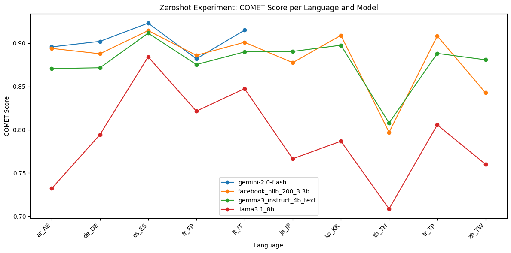
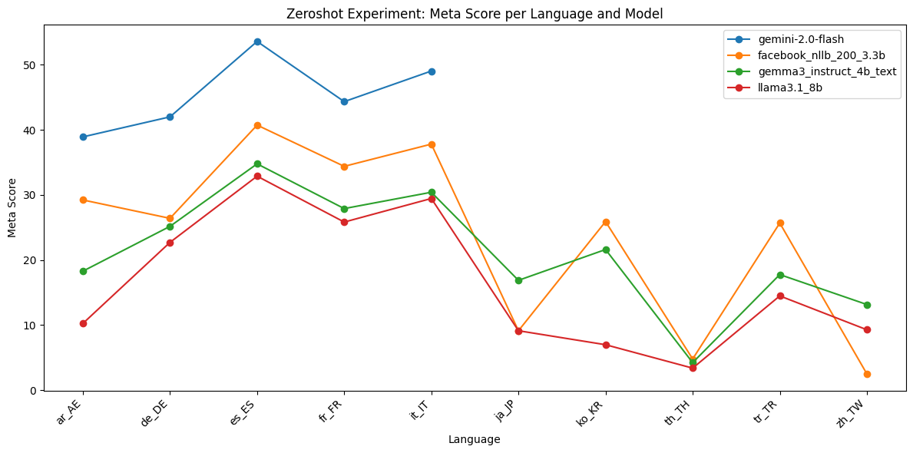
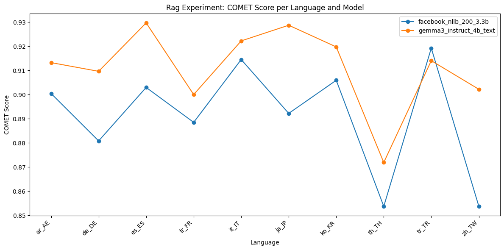
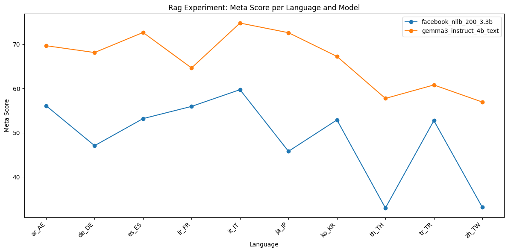

# Approaches

##  Zero Shot Prompting

### Experiment : Using gemma3_instruct_4b_text Model

#### Experiment Description

This experiment evaluates entity aware translation capabilities of the Gemma3 4B Text model (`gemma3_instruct_4b_text`) using a prompt-based approach. The evaluation is performed on multiple language pairs using validation data in JSONL format. The model is prompted to translate sentences from a source language to a target language, and its outputs are saved for further scoring.


##### Prompt Template
The following prompt template is used for each translation task:

```
<start_of_turn>user
    Translate the following sentence to {language}.
    Text: {text}
    Only output the translated text.
    Do not include any additional text or explanations.<end_of_turn>
    <start_of_turn>model
```

- `{language}` is replaced with the full name of the target language (e.g., "French").
- `{text}` is replaced with the source sentence to be translated.

##### Model Used
- **Model:** `gemma3_instruct_4b_text` (Gemma3 4B Text, loaded via Keras Hub)
- **Batching:** Translations are generated in batches for efficiency.
- **Output Extraction:** The model's output is parsed between `<start_of_turn>model` and `<end_of_turn>` tags to extract the translated text.

### Evaluations

#### COMET Scores

| Model                   | ar_AE   | de_DE   | es_ES   | fr_FR   | it_IT   | ja_JP   | ko_KR   | th_TH   | tr_TR   | zh_TW   |
|------------------------ |---------|---------|---------|---------|---------|---------|---------|---------|---------|---------|
| facebook_nllb_200_3.3b  | 0.89401 | 0.88784 | 0.91469 | 0.88604 | 0.90116 | 0.87755 | 0.90910 | 0.79699 | 0.90841 | 0.84277 |
| gemini-2.0-flash        | 0.89580 | 0.90218 | 0.92328 | 0.88199 | 0.91513 |    NA   |    NA   |    NA   |    NA   |    NA   |
| gemma3_instruct_4b_text | 0.87070 | 0.87166 | 0.91166 | 0.87538 | 0.88999 | 0.89056 | 0.89771 | 0.80772 | 0.88826 | 0.88088 |
| llama3.1_8b             | 0.73217 | 0.79436 | 0.88426 | 0.82143 | 0.84748 | 0.76645 | 0.78678 | 0.70851 | 0.80561 | 0.76020 |



#### Meta Scores

| Model                   | ar_AE   | de_DE   | es_ES   | fr_FR   | it_IT   | ja_JP   | ko_KR   | th_TH   | tr_TR   | zh_TW   |
|------------------------ |---------|---------|---------|---------|---------|---------|---------|---------|---------|---------|
| facebook_nllb_200_3.3b  | 29.2244 | 26.4022 | 40.7307 | 34.3923 | 37.8082 | 9.12863 | 25.9060 | 4.78873 | 25.6831 | 2.49308 |
| gemini-2.0-flash        | 38.9197 | 41.9973 | 53.5859 | 44.3370 | 49.0411 |    NA   |    NA   |    NA   |    NA   |    NA   |
| gemma3_instruct_4b_text | 18.2825 | 25.1710 | 34.7767 | 27.9006 | 30.4110 | 16.8741 | 21.6107 | 4.22535 | 17.7596 | 13.1579 |
| llama3.1_8b             | 10.2493 | 22.7086 | 32.8823 | 25.8287 | 29.4521 | 9.12863 | 6.97987 | 3.38028 | 14.4809 | 9.27978 |



#### Observations

- **Overall Performance:**
    - The `facebook_nllb_200_3.3b` and `gemini-2.0-flash` models achieve the highest COMET scores across most languages, with `gemini-2.0-flash` slightly outperforming in some cases where data is available.
    - `gemma3_instruct_4b_text` consistently performs well, with COMET scores close to the top models, especially in Japanese, Korean, and Chinese (where `gemini-2.0-flash` has missing data).
    - `llama3.1_8b` lags behind the other models in both COMET and Meta scores for all languages.

- **Language Trends:**
    - All models tend to perform best on Roman and Germanic languages (es_ES, it_IT, de_DE, fr_FR), with higher COMET and Meta scores.
    - Performance drops for languages like Thai (th_TH) and Chinese (zh_TW) across all models, with the lowest Meta scores observed for these languages.
    - `gemma3_instruct_4b_text` shows particularly strong performance in Japanese and Korean compared to `llama3.1_8b`.

- **Meta Score Insights:**
    - `gemini-2.0-flash` achieves the highest Meta scores where available, indicating strong translation quality and adequacy.
    - `facebook_nllb_200_3.3b` is the most consistent across all languages, with no missing data and solid Meta scores.
    - `gemma3_instruct_4b_text` outperforms `llama3.1_8b` in all languages for Meta score, and is competitive with the top models in several languages.

- **Conclusion:**
    - `gemma3_instruct_4b_text` performs well in the zero-shot setting, especially in Asian languages, and is competitive with larger or more established models in European languages.
    - `facebook_nllb_200_3.3b` is the most robust across all languages, while `gemini-2.0-flash` is the top performer where data is available.
    - `llama3.1_8b` is consistently outperformed by the other models in this evaluation.

## Retrieval Augmented Generation

In these experiments, we use an LLM model to first detect named entities in the sentence. This is followed by a Wikidata lookup to find the translations of the detected entities in the target language. The looked-up translations are then used to create an augmented prompt, which is fed to an LLM to translate the source sentence.

### Experiment Using gemma3_instruct_4b_text Model

#### Experiment Description

- Named entities are first extracted from the source sentence using the model.
- For each entity, a translation is retrieved from Wikidata (if available) for the target language.
- The prompt is augmented with a list of known entity translations to guide the model.


### Prompt Template for NER Detection
The following prompt template is used for each entity extraction task:

```
<start_of_turn>user
    Extract all named entities from the following text.
    For each entity, output a JSON object with keys: text, type (PER, LOC, ORG, MISC), and score (confidence 0-1).
    Output a JSON array.
    Do not include ```json or ``` in the output.
    Text: {text} <end_of_turn>
    <start_of_turn>model
```
- `{text}` is the source sentence from which to extract named entities.

### Prompt Template for NER Translation Augmented Generation
The following prompt template is used for each translation task:

```
<start_of_turn>user
    Translate the following sentence to {target_lang}.
    Use the following known entity translations:
    {entity_list}

    Text: {text}
    Only output the translated text.
    Do not include any additional text or explanations.<end_of_turn>
    <start_of_turn>model
```
- `{target_lang}` is replaced with the full name of the target language (e.g., "French").
- `{entity_list}` is a list of entity mappings in the form `original → translation` (one per line).
- `{text}` is replaced with the source sentence to be translated.

### Model Used
- **Model:** `gemma3_instruct_4b_text` (Gemma3 4B Text, loaded via Keras Hub)
- **Entity Extraction:** The model is used to extract named entities from the source sentence.
- **Wikidata Lookup:** Entity translations are retrieved from Wikidata and cached for efficiency.
- **Output Extraction:** The model's output is parsed between `<start_of_turn>model` and `<end_of_turn>` tags to extract the translated text.

### Evaluations

#### COMET Scores

| Model                   | ar_AE    | de_DE    | es_ES    | fr_FR    | it_IT    | ja_JP    | ko_KR    | th_TH    | tr_TR    | zh_TW    |
|-------------------------|----------|----------|----------|----------|----------|----------|----------|----------|----------|----------|
| facebook_nllb_200_3.3b  | 0.900469 | 0.880849 | 0.902992 | 0.888537 | 0.914546 | 0.892243 | 0.905956 | 0.853740 | 0.919268 | 0.853816 |
| gemma3_instruct_4b_text | 0.913272 | 0.909666 | 0.929734 | 0.900043 | 0.922269 | 0.928758 | 0.919779 | 0.871904 | 0.914075 | 0.902246 |



#### Meta Scores

| Model                   | ar_AE    | de_DE    | es_ES    | fr_FR    | it_IT    | ja_JP    | ko_KR    | th_TH    | tr_TR    | zh_TW    |
|-------------------------|----------|----------|----------|----------|----------|----------|----------|----------|----------|----------|
| facebook_nllb_200_3.3b  | 56.0942  | 47.0588  | 53.1800  | 55.9392  | 59.7260  | 45.7815  | 52.8859  | 32.9577  | 52.7322  | 33.1025  |
| gemma3_instruct_4b_text | 69.6676  | 68.1259  | 72.6658  | 64.6409  | 74.7945  | 72.6141  | 67.2483  | 57.7465  | 60.7924  | 56.9252  |



#### Observations

- **Overall Performance:**
    - The `gemma3_instruct_4b_text` model outperforms `facebook_nllb_200_3.3b` in both COMET and Meta scores across all languages in the RAG Wikidata setting.
    - The improvement is especially pronounced in Meta scores, where `gemma3_instruct_4b_text` achieves significantly higher values for every language.
    - Both models perform best on European languages (it_IT, es_ES, de_DE, fr_FR), but the gap between the models is consistent across all languages.
    - The lowest scores for both models are observed in Chinese (zh_TW) and Thai (th_TH), but `gemma3_instruct_4b_text` still maintains a clear lead.

- **Entity-Aware Augmentation Impact:**
    - The use of entity-aware augmentation and Wikidata lookups appears to provide a substantial benefit to the `gemma3_instruct_4b_text` model, as reflected in the higher Meta scores (e.g., 74.79 for it_IT, 72.67 for es_ES).
    - The COMET score improvements are more modest but still consistent, indicating better adequacy and fluency in the translations.

#### Conclusions

- The RAG Wikidata approach with `gemma3_instruct_4b_text` leads to state-of-the-art performance among the tested models for both COMET and Meta metrics.
- Entity-aware translation using Wikidata lookups is highly effective, especially for languages with rich entity content and for improving adequacy (Meta score).
- This method is robust across a wide range of languages, with the largest gains observed in Meta scores, suggesting improved handling of named entities and overall translation quality.
- The approach is recommended for scenarios where accurate entity translation is critical.
