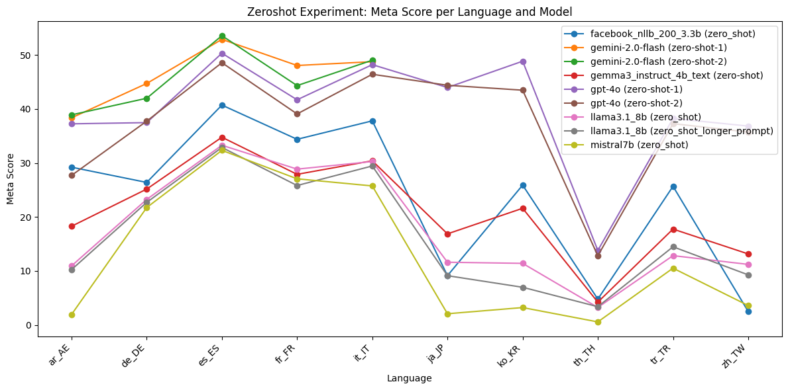
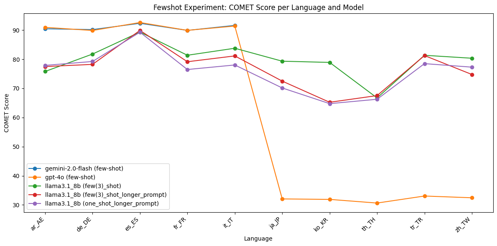

# Approaches

##  Zero Shot Prompting

### Experiment : Using gemma3_instruct_4b_text Model

#### Experiment Description

This experiment evaluates entity aware translation capabilities of the Gemma3 4B Text model (`gemma3_instruct_4b_text`) using a prompt-based approach. The evaluation is performed on multiple language pairs using validation data in JSONL format. The model is prompted to translate sentences from a source language to a target language, and its outputs are saved for further scoring.


##### Prompt Template
The following prompt template is used for each translation task:

```
<start_of_turn>user
    Translate the following sentence to {language}.
    Text: {text}
    Only output the translated text.
    Do not include any additional text or explanations.<end_of_turn>
    <start_of_turn>model
```

- `{language}` is replaced with the full name of the target language (e.g., "French").
- `{text}` is replaced with the source sentence to be translated.

##### Model Used
- **Model:** `gemma3_instruct_4b_text` (Gemma3 4B Text, loaded via Keras Hub)
- **Batching:** Translations are generated in batches for efficiency.
- **Output Extraction:** The model's output is parsed between `<start_of_turn>model` and `<end_of_turn>` tags to extract the translated text.

### Evaluations

#### COMET Scores

| Model                                   | ar_AE    | de_DE    | es_ES    | fr_FR    | it_IT    | ja_JP    | ko_KR    | th_TH    | tr_TR    | zh_TW    |
|------------------------------------------|----------|----------|----------|----------|----------|----------|----------|----------|----------|----------|
| facebook_nllb_200_3.3b (zero_shot)      | 0.894012 | 0.887837 | 0.914690 | 0.886039 | 0.901158 | 0.877546 | 0.909104 | 0.796988 | 0.908409 | 0.842765 |
| gemini-2.0-flash (zero-shot-1)          | 0.907877 | 0.904798 | 0.924312 | 0.905125 | 0.912862 |    NA    |    NA    |    NA    |    NA    |    NA    |
| gemini-2.0-flash (zero-shot-2)          | 0.895801 | 0.902184 | 0.923279 | 0.881997 | 0.915130 |    NA    |    NA    |    NA    |    NA    |    NA    |
| gemma3_instruct_4b_text (zero-shot)     | 0.870702 | 0.871655 | 0.911657 | 0.875383 | 0.889993 | 0.890555 | 0.897712 | 0.807715 | 0.888256 | 0.880877 |
| gpt-4o (zero-shot-1)                    | 0.908606 | 0.897374 | 0.922383 | 0.900818 | 0.914007 | 0.936411 | 0.934396 | 0.829915 | 0.926527 | 0.922842 |
| gpt-4o (zero-shot-2)                    | 0.885450 | 0.897071 | 0.920620 | 0.896157 | 0.910552 | 0.932317 | 0.927710 | 0.818079 | 0.925739 | 0.921094 |
| llama3.1_8b (zero_shot)                 | 0.814061 | 0.857946 | 0.901855 | 0.860470 | 0.879568 | 0.851725 | 0.844446 | 0.721428 | 0.842651 | 0.824786 |
| llama3.1_8b (zero_shot_longer_prompt)   | 0.732168 | 0.794364 | 0.884256 | 0.821433 | 0.847478 | 0.766446 | 0.786775 | 0.708514 | 0.805609 | 0.760198 |


#### Meta Scores

| Model                                   | ar_AE     | de_DE     | es_ES     | fr_FR     | it_IT     | ja_JP     | ko_KR     | th_TH     | tr_TR     | zh_TW     |
|------------------------------------------|-----------|-----------|-----------|-----------|-----------|-----------|-----------|-----------|-----------|-----------|
| facebook_nllb_200_3.3b (zero_shot)      | 29.224377 | 26.402189 | 40.730717 | 34.392265 | 37.808219 | 9.128631  | 25.906040 | 4.788732  | 25.683060 | 2.493075  |
| gemini-2.0-flash (zero-shot-1)          | 38.365651 | 44.733242 | 52.909337 | 48.066298 | 48.767123 | NA        | NA        | NA        | NA        | NA        |
| gemini-2.0-flash (zero-shot-2)          | 38.919668 | 41.997264 | 53.585927 | 44.337017 | 49.041096 | NA        | NA        | NA        | NA        | NA        |
| gemma3_instruct_4b_text (zero-shot)     | 18.282548 | 25.170999 | 34.776725 | 27.900552 | 30.410959 | 16.874136 | 21.610738 | 4.225352  | 17.759563 | 13.157895 |
| gpt-4o (zero-shot-1)                    | 37.257618 | 37.482900 | 50.338295 | 41.712707 | 48.219178 | 43.983402 | 48.859060 | 13.802817 | 38.251366 | 36.842105 |
| gpt-4o (zero-shot-2)                    | 27.700831 | 37.756498 | 48.579161 | 39.088398 | 46.438356 | 44.398340 | 43.489933 | 12.816901 | 37.295082 | 35.734072 |
| llama3.1_8b (zero_shot)                 | 10.941828 | 23.255814 | 33.288227 | 28.867403 | 30.273973 | 11.618257 | 11.409396 | 3.239437  | 12.841530 | 11.218837 |
| llama3.1_8b (zero_shot_longer_prompt)   | 10.249307 | 22.708618 | 32.882273 | 25.828729 | 29.452055 | 9.128631  | 6.979866  | 3.380282  | 14.480874 | 9.279778  |




### Final Score (Harmonic Mean of COMET and META)

| Model                                   | ar_AE    | de_DE    | es_ES    | fr_FR    | it_IT    | ja_JP    | ko_KR    | th_TH    | tr_TR    | zh_TW    |
|------------------------------------------|----------|----------|----------|----------|----------|----------|----------|----------|----------|----------|
| facebook_nllb_200_3.3b (zero_shot)      | 1.734949 | 1.717905 | 1.789201 | 1.727571 | 1.760357 | 1.601170 | 1.756566 | 1.366542 | 1.754752 | 1.259698 |
| gemini-2.0-flash (zero-shot-1)          | 1.773780 | 1.773719 | 1.816884 | 1.776792 | 1.792177 | NA       | NA       | NA       | NA       | NA       |
| gemini-2.0-flash (zero-shot-2)          | 1.751294 | 1.766421 | 1.815281 | 1.729587 | 1.796732 | NA       | NA       | NA       | NA       | NA       |
| gemma3_instruct_4b_text (zero-shot)     | 1.662241 | 1.684962 | 1.776737 | 1.697507 | 1.729375 | 1.691822 | 1.723816 | 1.356183 | 1.691891 | 1.651211 |
| gpt-4o (zero-shot-1)                    | 1.773950 | 1.752784 | 1.811571 | 1.763552 | 1.794008 | 1.833781 | 1.833723 | 1.565691 | 1.809230 | 1.800583 |
| gpt-4o (zero-shot-2)                    | 1.716047 | 1.752504 | 1.806996 | 1.752143 | 1.786082 | 1.826284 | 1.816668 | 1.537991 | 1.806634 | 1.795895 |
| llama3.1_8b (zero_shot)                 | 1.515378 | 1.654842 | 1.756131 | 1.671127 | 1.709471 | 1.587101 | 1.572505 | 1.180055 | 1.581523 | 1.536603 |
| llama3.1_8b (zero_shot_longer_prompt)   | 1.366705 | 1.535031 | 1.722199 | 1.592229 | 1.647548 | 1.414159 | 1.414146 | 1.171483 | 1.526305 | 1.405275 |

-per-language-and-model.png)

#### Observations

- **COMET Scores:** `gpt-4o` and `gemini-2.0-flash` consistently achieve the highest COMET scores across high-resource languages, indicating strong adequacy and fluency. `facebook_nllb_200_3.3b` is robust and covers all languages, but is slightly behind the top models. `gemma3_instruct_4b_text` and `llama3.1_8b` lag behind, especially in low-resource and Asian languages.
- **META Scores:** `gemini-2.0-flash` and `gpt-4o` again lead in META scores for high-resource languages, with `facebook_nllb_200_3.3b` providing broad but lower coverage. META scores for `llama3.1_8b` and `gemma3_instruct_4b_text` are notably lower, especially for Asian and low-resource languages, highlighting adequacy challenges.
- **Final Score:** The harmonic mean of COMET and META confirms that `gpt-4o` and `gemini-2.0-flash` are the most consistent top performers for high-resource languages. `facebook_nllb_200_3.3b` is a strong baseline for broad coverage, but the largest performance gaps are seen in low-resource and Asian languages, where adequacy (META) is a limiting factor.

#### Conclusion

- The combined metrics show that `gpt-4o` and `gemini-2.0-flash` are the best-performing models in the zero-shot setting, especially for high-resource languages. `facebook_nllb_200_3.3b` remains a reliable baseline for broad language coverage. The Final Score metric provides a holistic view, emphasizing the importance of both adequacy and fluency, and highlights the need for further improvement in low-resource and Asian languages.

## Retrieval Augmented Generation

In these experiments, we use an LLM model to first detect named entities in the sentence. This is followed by a Wikidata lookup to find the translations of the detected entities in the target language. The looked-up translations are then used to create an augmented prompt, which is fed to an LLM to translate the source sentence.

### Experiment Using gemma3_instruct_4b_text Model

#### Experiment Description

- Named entities are first extracted from the source sentence using the model.
- For each entity, a translation is retrieved from Wikidata (if available) for the target language.
- The prompt is augmented with a list of known entity translations to guide the model.


### Prompt Template for NER Detection
The following prompt template is used for each entity extraction task:

```
<start_of_turn>user
    Extract all named entities from the following text.
    For each entity, output a JSON object with keys: text, type (PER, LOC, ORG, MISC), and score (confidence 0-1).
    Output a JSON array.
    Do not include ```json or ``` in the output.
    Text: {text} <end_of_turn>
    <start_of_turn>model
```
- `{text}` is the source sentence from which to extract named entities.

### Prompt Template for NER Translation Augmented Generation
The following prompt template is used for each translation task:

```
<start_of_turn>user
    Translate the following sentence to {target_lang}.
    Use the following known entity translations:
    {entity_list}

    Text: {text}
    Only output the translated text.
    Do not include any additional text or explanations.<end_of_turn>
    <start_of_turn>model
```
- `{target_lang}` is replaced with the full name of the target language (e.g., "French").
- `{entity_list}` is a list of entity mappings in the form `original → translation` (one per line).
- `{text}` is replaced with the source sentence to be translated.

### Model Used
- **Model:** `gemma3_instruct_4b_text` (Gemma3 4B Text, loaded via Keras Hub)
- **Entity Extraction:** The model is used to extract named entities from the source sentence.
- **Wikidata Lookup:** Entity translations are retrieved from Wikidata and cached for efficiency.
- **Output Extraction:** The model's output is parsed between `<start_of_turn>model` and `<end_of_turn>` tags to extract the translated text.

### Evaluations

#### COMET Scores

| Model                                         | ar_AE   | de_DE   | es_ES   | fr_FR   | it_IT   | ja_JP   | ko_KR   | th_TH   | tr_TR   | zh_TW   |
|-----------------------------------------------|---------|---------|---------|---------|---------|---------|---------|---------|---------|---------|
| facebook_nllb_200_3.3b (rag-wikidata)         | 0.89909 | 0.87615 | 0.90478 | 0.89484 | 0.91290 | 0.90120 | 0.90541 | 0.84491 | 0.91447 | 0.85390 |
| facebook_nllb_200_3.3b (rag-wikidata-entity-ty...) | 0.90047 | 0.88085 | 0.90299 | 0.88854 | 0.91455 | 0.89224 | 0.90596 | 0.85374 | 0.91927 | 0.85382 |
| gemma3_instruct_4b_text (rag-wikidata)        | 0.91327 | 0.90967 | 0.92973 | 0.90004 | 0.92227 | 0.92876 | 0.91978 | 0.87190 | 0.91408 | 0.90225 |
| mistral7b (one_shot_rag_wikidata)             | 0.72193 | 0.87978 | 0.91385 | 0.87032 | 0.90278 | 0.85971 | 0.86150 | 0.58054 | 0.76422 | 0.85738 |
| mistral7b (zero_shot_rag_wikidata)            | 0.63602 | 0.84168 | 0.88947 | 0.84423 | 0.86939 | 0.79624 | 0.79292 | 0.46545 | 0.71480 | 0.77705 |


#### Meta Scores

| Model                                              | ar_AE     | de_DE     | es_ES     | fr_FR     | it_IT     | ja_JP     | ko_KR     | th_TH     | tr_TR     | zh_TW     |
|----------------------------------------------------|-----------|-----------|-----------|-----------|-----------|-----------|-----------|-----------|-----------|-----------|
| facebook_nllb_200_3.3b (rag-wikidata)              | 56.371191 | 46.648427 | 55.615697 | 58.563536 | 61.095890 | 48.409405 | 47.248322 | 31.126761 | 50.546448 | 31.855956 |
| facebook_nllb_200_3.3b (rag-wikidata-entity-type)  | 56.094183 | 47.058824 | 53.179973 | 55.939227 | 59.726027 | 45.781466 | 52.885906 | 32.957746 | 52.732240 | 33.102493 |
| gemma3_instruct_4b_text (rag-wikidata)             | 69.667590 | 68.125855 | 72.665765 | 64.640884 | 74.794521 | 72.614108 | 67.248322 | 57.746479 | 60.792350 | 56.925208 |
| mistral7b (one_shot_rag_wikidata)                  | 57.756233 | 58.823529 | 70.635995 | 53.176796 | 62.876712 | 53.250346 | 54.765101 | 44.366197 | 41.530055 | 49.584488 |
| mistral7b (zero_shot_rag_wikidata)                 |  1.800554 | 21.887825 | 31.258457 | 26.381215 | 25.068493 |  3.181189 |  2.281879 |  0.281690 | 10.109290 |  4.016620 |


### Final Score (Harmonic Mean of COMET and META)

| Model                                              | ar_AE    | de_DE    | es_ES    | fr_FR    | it_IT    | ja_JP    | ko_KR    | th_TH    | tr_TR    | zh_TW    |
|----------------------------------------------------|----------|----------|----------|----------|----------|----------|----------|----------|----------|----------|
| facebook_nllb_200_3.3b (rag-wikidata)              | 1.769955 | 1.719985 | 1.780599 | 1.762738 | 1.798918 | 1.769457 | 1.776777 | 1.645162 | 1.796439 | 1.663220 |
| facebook_nllb_200_3.3b (rag-wikidata-entity-type)  | 1.772485 | 1.729328 | 1.775830 | 1.749289 | 1.801507 | 1.750372 | 1.781395 | 1.664365 | 1.807034 | 1.664695 |
| gemma3_instruct_4b_text (rag-wikidata)             | 1.802910 | 1.795359 | 1.835977 | 1.775366 | 1.822070 | 1.834058 | 1.814737 | 1.717870 | 1.801070 | 1.776337 |
| mistral7b (one_shot_rag_wikidata)                  | 1.426025 | 1.733629 | 1.804350 | 1.712604 | 1.779998 | 1.692108 | 1.696306 | 1.146089 | 1.500816 | 1.685619 |
| mistral7b (zero_shot_rag_wikidata)                 | 0.939998 | 1.621023 | 1.729727 | 1.636106 | 1.680502 | 1.273685 | 1.176889 | 0.350972 | 1.335186 | 1.302176 |

-per-language-and-model.png)

#### Observations

- **COMET Scores:** `gemma3_instruct_4b_text (rag-wikidata)` achieves the highest COMET scores across nearly all languages, demonstrating the benefit of entity-aware augmentation. `facebook_nllb_200_3.3b` (both RAG variants) is strong and consistent, while `mistral7b` is competitive in some European languages but weaker elsewhere.
- **META Scores:** The META scores show a substantial advantage for `gemma3_instruct_4b_text (rag-wikidata)`, especially in adequacy-heavy languages. `facebook_nllb_200_3.3b` is consistent, but `mistral7b` and its zero-shot RAG variant perform poorly in low-resource and Asian languages.
- **Final Score:** The harmonic mean highlights the superior performance of `gemma3_instruct_4b_text (rag-wikidata)` in both adequacy and fluency, with the largest gains in languages with complex named entities. The RAG approach is especially effective for adequacy (META) in these settings.

#### Conclusions

- The RAG Wikidata approach with `gemma3_instruct_4b_text` delivers state-of-the-art performance, especially in adequacy and entity handling, as reflected in the Final Score. Entity-aware translation using Wikidata lookups is highly effective, particularly for languages and settings where entity translation is challenging. The combined metrics confirm the robustness of the RAG approach for named-entity-rich content.

## Few Shot Prompting

### COMET Scores

| Model                                    | ar_AE    | de_DE    | es_ES    | fr_FR    | it_IT    | ja_JP    | ko_KR    | th_TH    | tr_TR    | zh_TW    |
|------------------------------------------|----------|----------|----------|----------|----------|----------|----------|----------|----------|----------|
| gemini-2.0-flash (few-shot)              | 0.904642 | 0.901906 | 0.923532 | 0.899110 | 0.916286 | NA       | NA       | NA       | NA       | NA       |
| gpt-4o (few-shot)                        | 0.909567 | 0.898799 | 0.926188 | 0.899244 | 0.914019 | 0.320419 | 0.318831 | 0.306257 | 0.330402 | 0.324356 |
| llama3.1_8b (few(3)_shot)                | 0.758065 | 0.817910 | 0.893370 | 0.813730 | 0.837820 | 0.793364 | 0.789159 | 0.667263 | 0.813619 | 0.803496 |
| llama3.1_8b (few(3)_shot_longer_prompt)  | 0.775002 | 0.782419 | 0.899149 | 0.791490 | 0.811485 | 0.724958 | 0.652297 | 0.675251 | 0.812732 | 0.747750 |
| llama3.1_8b (one_shot_longer_prompt)     | 0.778907 | 0.792391 | 0.892918 | 0.764773 | 0.780366 | 0.701464 | 0.647615 | 0.662619 | 0.784995 | 0.772904 |




### META Scores

| Model                                    | ar_AE     | de_DE     | es_ES     | fr_FR     | it_IT     | ja_JP     | ko_KR     | th_TH     | tr_TR     | zh_TW     |
|------------------------------------------|-----------|-----------|-----------|-----------|-----------|-----------|-----------|-----------|-----------|-----------|
| gemini-2.0-flash (few-shot)              | 40.027701 | 46.238030 | 53.179973 | 43.646409 | 49.178082 | NA        | NA        | NA        | NA        | NA        |
| gpt-4o (few-shot)                        | 40.304709 | 41.997264 | 55.074425 | 41.436464 | 49.863014 | 0.0       | 0.0       | 0.0       | 0.0       | 0.0       |
| llama3.1_8b (few(3)_shot)                | 9.695291  | 22.298222 | 33.423545 | 26.933702 | 31.095890 | 13.001383 | 9.127517  | 2.535211  | 15.983607 | 11.772853 |
| llama3.1_8b (few(3)_shot_longer_prompt)  | 0.277008  | 20.383037 | 33.694181 | 23.480663 | 29.041096 | 6.224066  | 4.295302  | 2.394366  | 13.797814 | 10.526316 |
| llama3.1_8b (one_shot_longer_prompt)     | 10.249307 | 18.057456 | 31.664411 | 24.585635 | 24.931507 | 4.149378  | 4.697987  | 2.112676  | 14.344262 | 10.387812 |


### Final Score (Harmonic Mean of COMET and META)

| Model                                 | ar_AE    | de_DE    | es_ES    | fr_FR    | it_IT    | ja_JP    | ko_KR    | th_TH    | tr_TR    | zh_TW    |
|----------------------------------------|----------|----------|----------|----------|----------|----------|----------|----------|----------|----------|
| gemini-2.0-flash (few-shot)            | 1.769297 | 1.769300 | 1.815535 | 1.761925 | 1.799052 | NA       | NA       | NA       | NA       | NA       |
| gpt-4o (few-shot)                      | 1.778987 | 1.759932 | 1.821741 | 1.760286 | 1.795133 | 0.0      | 0.0      | 0.0      | 0.0      | 0.0      |
| llama3.1_8b (few(3)_shot)              | 1.406182 | 1.577941 | 1.740225 | 1.579732 | 1.631677 | 1.495471 | 1.452717 | 1.056466 | 1.548417 | 1.504323 |
| llama3.1_8b (few(3)_shot_longer_prompt)| 0.408137 | 1.506990 | 1.751557 | 1.531361 | 1.578853 | 1.298654 | 1.132594 | 1.053421 | 1.535046 | 1.396311 |
| llama3.1_8b (one_shot_longer_prompt)   | 1.447787 | 1.518163 | 1.736858 | 1.483402 | 1.513363 | 1.200056 | 1.138314 | 1.008829 | 1.488529 | 1.438758 |


-per-language-and-model.png)

#### Observations
- **COMET Scores:** `gpt-4o` and `gemini-2.0-flash` achieve the highest COMET scores in the few-shot setting for high-resource languages. `llama3.1_8b` lags behind, especially in low-resource and Asian languages.
- **META Scores:** `gpt-4o` and `gemini-2.0-flash` again lead in META scores for high-resource languages, but `gpt-4o` shows a sharp drop in META for Asian languages, indicating a challenge in adequacy. `llama3.1_8b` and its variants have the lowest META scores, especially for low-resource languages.
- **Final Score:** The harmonic mean confirms that `gpt-4o` and `gemini-2.0-flash` are the best in the few-shot setting for high-resource languages, but all models struggle with adequacy in low-resource and Asian languages, as seen in the lower Final Scores.

#### Conclusion
- `gpt-4o` and `gemini-2.0-flash` are the best-performing models in the few-shot setting for high-resource languages. However, adequacy remains a challenge for all models in low-resource and Asian languages. The Final Score metric highlights the need for further improvements in these settings, and the importance of both adequacy and fluency in evaluation.

## Chain-of-Thought (CoT) Prompting

### COMET Scores

| Model                      | ar_AE    | de_DE    | es_ES    | fr_FR    | it_IT    | ja_JP   | ko_KR   | th_TH   | tr_TR   | zh_TW   |
|----------------------------|----------|----------|----------|----------|----------|---------|---------|---------|---------|---------|
| gemini-2.0-flash (cot)     | 0.898485 | 0.900797 | 0.922098 | 0.900923 | 0.910102 | NA      | NA      | NA      | NA      | NA      |
| gpt-4o (cot)               | 0.891195 | 0.898929 | 0.922957 | 0.898582 | 0.911873 | 0.933051| 0.934914| 0.833996| 0.922442| 0.925292 |


### META Scores

| Model                   | ar_AE     | de_DE     | es_ES     | fr_FR     | it_IT     | ja_JP | ko_KR | th_TH | tr_TR | zh_TW |
|-------------------------|-----------|-----------|-----------|-----------|-----------|-------|-------|-------|-------|-------|
| gemini-2.0-flash (cot)  | 36.703601 | 42.270862 | 51.691475 | 45.027624 | 42.054795 | NA    | NA    | NA    | NA    | NA    |
| gpt-4o (cot)            | 31.578947 | 40.218878 | 53.179973 | 42.127072 | 47.534247 | 43.153527 | 47.651007 | 14.647887 | 36.885246 | 38.781163 |


### Final Score (Harmonic Mean of COMET and META)

| Model                    | ar_AE    | de_DE    | es_ES    | fr_FR    | it_IT    | ja_JP    | ko_KR    | th_TH    | tr_TR    | zh_TW    |
|--------------------------|----------|----------|----------|----------|----------|----------|----------|----------|----------|----------|
| gemini-2.0-flash (cot)   | 1.754031 | 1.764004 | 1.811874 | 1.766501 | 1.781647 | NA       | NA       | NA       | NA       | NA       |
| gpt-4o (cot)             | 1.733469 | 1.758553 | 1.814425 | 1.759631 | 1.789419 | 1.826608 | 1.833847 | 1.578139 | 1.799872 | 1.807458 |


-per-language-and-model.png)

#### Observations
- **COMET Scores:** In the CoT setting, `gpt-4o` and `gemini-2.0-flash` achieve the highest COMET scores for high-resource languages. `gpt-4o` also performs well in Asian languages, but there is a notable drop in adequacy (META) for some languages.
- **META Scores:** `gpt-4o` and `gemini-2.0-flash` lead in META scores for high-resource languages, but all models show lower META scores for low-resource and Asian languages, indicating persistent adequacy challenges.
- **Final Score:** The harmonic mean shows that `gpt-4o` and `gemini-2.0-flash` are the most robust in the CoT setting for high-resource languages, but adequacy remains a limiting factor for all models in more challenging languages.

#### Conclusion
- `gpt-4o` and `gemini-2.0-flash` are the top models in the CoT setting for high-resource languages, but all models face challenges in adequacy for low-resource and Asian languages. The Final Score metric underscores the need for further research and model improvements to address these gaps, and demonstrates the value of using both adequacy and fluency metrics for comprehensive evaluation.
