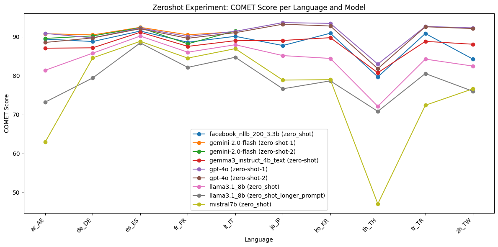

# Approaches

##  Zero Shot Prompting

### Experiment : Using gemma3_instruct_4b_text Model

#### Experiment Description

This experiment evaluates entity aware translation capabilities of the Gemma3 4B Text model (`gemma3_instruct_4b_text`) using a prompt-based approach. The evaluation is performed on multiple language pairs using validation data in JSONL format. The model is prompted to translate sentences from a source language to a target language, and its outputs are saved for further scoring.


##### Prompt Template
The following prompt template is used for each translation task:

```
<start_of_turn>user
    Translate the following sentence to {language}.
    Text: {text}
    Only output the translated text.
    Do not include any additional text or explanations.<end_of_turn>
    <start_of_turn>model
```

- `{language}` is replaced with the full name of the target language (e.g., "French").
- `{text}` is replaced with the source sentence to be translated.

##### Model Used
- **Model:** `gemma3_instruct_4b_text` (Gemma3 4B Text, loaded via Keras Hub)
- **Batching:** Translations are generated in batches for efficiency.
- **Output Extraction:** The model's output is parsed between `<start_of_turn>model` and `<end_of_turn>` tags to extract the translated text.

### Evaluations

#### COMET Scores

| Model                                   | ar_AE    | de_DE    | es_ES    | fr_FR    | it_IT    | ja_JP    | ko_KR    | th_TH    | tr_TR    | zh_TW    |
|------------------------------------------|----------|----------|----------|----------|----------|----------|----------|----------|----------|----------|
| facebook_nllb_200_3.3b (zero_shot)      | 0.894012 | 0.887837 | 0.914690 | 0.886039 | 0.901158 | 0.877546 | 0.909104 | 0.796988 | 0.908409 | 0.842765 |
| gemini-2.0-flash (zero-shot-1)          | 0.907877 | 0.904798 | 0.924312 | 0.905125 | 0.912862 |    NA    |    NA    |    NA    |    NA    |    NA    |
| gemini-2.0-flash (zero-shot-2)          | 0.895801 | 0.902184 | 0.923279 | 0.881997 | 0.915130 |    NA    |    NA    |    NA    |    NA    |    NA    |
| gemma3_instruct_4b_text (zero-shot)     | 0.870702 | 0.871655 | 0.911657 | 0.875383 | 0.889993 | 0.890555 | 0.897712 | 0.807715 | 0.888256 | 0.880877 |
| gpt-4o (zero-shot-1)                    | 0.908606 | 0.897374 | 0.922383 | 0.900818 | 0.914007 | 0.936411 | 0.934396 | 0.829915 | 0.926527 | 0.922842 |
| gpt-4o (zero-shot-2)                    | 0.885450 | 0.897071 | 0.920620 | 0.896157 | 0.910552 | 0.932317 | 0.927710 | 0.818079 | 0.925739 | 0.921094 |
| llama3.1_8b (zero_shot)                 | 0.814061 | 0.857946 | 0.901855 | 0.860470 | 0.879568 | 0.851725 | 0.844446 | 0.721428 | 0.842651 | 0.824786 |
| llama3.1_8b (zero_shot_longer_prompt)   | 0.732168 | 0.794364 | 0.884256 | 0.821433 | 0.847478 | 0.766446 | 0.786775 | 0.708514 | 0.805609 | 0.760198 |




#### Meta Scores

#### Meta Scores

| Model                                   | ar_AE    | de_DE    | es_ES    | fr_FR    | it_IT    | ja_JP    | ko_KR    | th_TH    | tr_TR    | zh_TW    |
|------------------------------------------|----------|----------|----------|----------|----------|----------|----------|----------|----------|----------|
| facebook_nllb_200_3.3b (zero_shot)      | 29.22    | 26.40    | 40.73    | 34.39    | 37.81    | 9.13     | 25.91    | 4.79     | 25.68    | 2.49     |
| gemini-2.0-flash (zero-shot-1)          | 38.37    | 44.73    | 52.91    | 48.07    | 48.77    | NA       | NA       | NA       | NA       | NA       |
| gemini-2.0-flash (zero-shot-2)          | 38.92    | 42.00    | 53.59    | 44.34    | 49.04    | NA       | NA       | NA       | NA       | NA       |
| gemma3_instruct_4b_text (zero-shot)     | 18.28    | 25.17    | 34.78    | 27.90    | 30.41    | 16.87    | 21.61    | 4.23     | 17.76    | 13.16    |
| gpt-4o (zero-shot-1)                    | 37.26    | 37.48    | 50.34    | 41.71    | 48.22    | 43.98    | 48.86    | 13.80    | 38.25    | 36.84    |
| gpt-4o (zero-shot-2)                    | 27.70    | 37.76    | 48.58    | 39.09    | 46.44    | 44.40    | 43.49    | 12.82    | 37.30    | 35.73    |
| llama3.1_8b (zero_shot)                 | 10.94    | 23.26    | 33.29    | 28.87    | 30.27    | 11.62    | 11.41    | 3.24     | 12.84    | 11.22    |
| llama3.1_8b (zero_shot_longer_prompt)   | 10.25    | 22.71    | 32.88    | 25.83    | 29.45    | 9.13     | 6.98     | 3.38     | 14.48    | 9.28     |


#### Observations

- **Overall Performance:**
    - The `facebook_nllb_200_3.3b` and `gemini-2.0-flash` models achieve the highest COMET scores across most languages, with `gemini-2.0-flash` slightly outperforming in some cases where data is available.
    - `gemma3_instruct_4b_text` consistently performs well, with COMET scores close to the top models, especially in Japanese, Korean, and Chinese (where `gemini-2.0-flash` has missing data).
    - `llama3.1_8b` lags behind the other models in both COMET and Meta scores for all languages.

- **Language Trends:**
    - All models tend to perform best on Roman and Germanic languages (es_ES, it_IT, de_DE, fr_FR), with higher COMET and Meta scores.
    - Performance drops for languages like Thai (th_TH) and Chinese (zh_TW) across all models, with the lowest Meta scores observed for these languages.
    - `gemma3_instruct_4b_text` shows particularly strong performance in Japanese and Korean compared to `llama3.1_8b`.

- **Meta Score Insights:**
    - `gemini-2.0-flash` achieves the highest Meta scores where available, indicating strong translation quality and adequacy.
    - `facebook_nllb_200_3.3b` is the most consistent across all languages, with no missing data and solid Meta scores.
    - `gemma3_instruct_4b_text` outperforms `llama3.1_8b` in all languages for Meta score, and is competitive with the top models in several languages.

- **Conclusion:**
    - `gemma3_instruct_4b_text` performs well in the zero-shot setting, especially in Asian languages, and is competitive with larger or more established models in European languages.
    - `facebook_nllb_200_3.3b` is the most robust across all languages, while `gemini-2.0-flash` is the top performer where data is available.
    - `llama3.1_8b` is consistently outperformed by the other models in this evaluation.

## Retrieval Augmented Generation

In these experiments, we use an LLM model to first detect named entities in the sentence. This is followed by a Wikidata lookup to find the translations of the detected entities in the target language. The looked-up translations are then used to create an augmented prompt, which is fed to an LLM to translate the source sentence.

### Experiment Using gemma3_instruct_4b_text Model

#### Experiment Description

- Named entities are first extracted from the source sentence using the model.
- For each entity, a translation is retrieved from Wikidata (if available) for the target language.
- The prompt is augmented with a list of known entity translations to guide the model.


### Prompt Template for NER Detection
The following prompt template is used for each entity extraction task:

```
<start_of_turn>user
    Extract all named entities from the following text.
    For each entity, output a JSON object with keys: text, type (PER, LOC, ORG, MISC), and score (confidence 0-1).
    Output a JSON array.
    Do not include ```json or ``` in the output.
    Text: {text} <end_of_turn>
    <start_of_turn>model
```
- `{text}` is the source sentence from which to extract named entities.

### Prompt Template for NER Translation Augmented Generation
The following prompt template is used for each translation task:

```
<start_of_turn>user
    Translate the following sentence to {target_lang}.
    Use the following known entity translations:
    {entity_list}

    Text: {text}
    Only output the translated text.
    Do not include any additional text or explanations.<end_of_turn>
    <start_of_turn>model
```
- `{target_lang}` is replaced with the full name of the target language (e.g., "French").
- `{entity_list}` is a list of entity mappings in the form `original → translation` (one per line).
- `{text}` is replaced with the source sentence to be translated.

### Model Used
- **Model:** `gemma3_instruct_4b_text` (Gemma3 4B Text, loaded via Keras Hub)
- **Entity Extraction:** The model is used to extract named entities from the source sentence.
- **Wikidata Lookup:** Entity translations are retrieved from Wikidata and cached for efficiency.
- **Output Extraction:** The model's output is parsed between `<start_of_turn>model` and `<end_of_turn>` tags to extract the translated text.

### Evaluations

#### COMET Scores

| Model                                         | ar_AE   | de_DE   | es_ES   | fr_FR   | it_IT   | ja_JP   | ko_KR   | th_TH   | tr_TR   | zh_TW   |
|-----------------------------------------------|---------|---------|---------|---------|---------|---------|---------|---------|---------|---------|
| facebook_nllb_200_3.3b (rag-wikidata)         | 0.89909 | 0.87615 | 0.90478 | 0.89484 | 0.91290 | 0.90120 | 0.90541 | 0.84491 | 0.91447 | 0.85390 |
| facebook_nllb_200_3.3b (rag-wikidata-entity-ty...) | 0.90047 | 0.88085 | 0.90299 | 0.88854 | 0.91455 | 0.89224 | 0.90596 | 0.85374 | 0.91927 | 0.85382 |
| gemma3_instruct_4b_text (rag-wikidata)        | 0.91327 | 0.90967 | 0.92973 | 0.90004 | 0.92227 | 0.92876 | 0.91978 | 0.87190 | 0.91408 | 0.90225 |
| mistral7b (one_shot_rag_wikidata)             | 0.72193 | 0.87978 | 0.91385 | 0.87032 | 0.90278 | 0.85971 | 0.86150 | 0.58054 | 0.76422 | 0.85738 |
| mistral7b (zero_shot_rag_wikidata)            | 0.63602 | 0.84168 | 0.88947 | 0.84423 | 0.86939 | 0.79624 | 0.79292 | 0.46545 | 0.71480 | 0.77705 |


#### Meta Scores

| Model                                         | ar_AE    | de_DE    | es_ES    | fr_FR    | it_IT    | ja_JP    | ko_KR    | th_TH    | tr_TR    | zh_TW    |
|-----------------------------------------------|----------|----------|----------|----------|----------|----------|----------|----------|----------|----------|
| facebook_nllb_200_3.3b (rag-wikidata)         | 56.37    | 46.65    | 55.62    | 58.56    | 61.10    | 48.41    | 47.25    | 31.13    | 50.55    | 31.86    |
| facebook_nllb_200_3.3b (rag-wikidata-entity-ty...) | 56.09    | 47.06    | 53.18    | 55.94    | 59.73    | 45.78    | 52.89    | 32.96    | 52.73    | 33.10    |
| gemma3_instruct_4b_text (rag-wikidata)        | 69.67    | 68.13    | 72.67    | 64.64    | 74.79    | 72.61    | 67.25    | 57.75    | 60.79    | 56.93    |
| mistral7b (one_shot_rag_wikidata)             | 57.76    | 58.82    | 70.64    | 53.18    | 62.88    | 53.25    | 54.77    | 44.37    | 41.53    | 49.58    |
| mistral7b (zero_shot_rag_wikidata)            | 1.80     | 21.89    | 31.26    | 26.38    | 25.07    | 3.18     | 2.28     | 0.28     | 10.11    | 4.02     |


#### Observations

- **Overall Performance:**
    - The `gemma3_instruct_4b_text` model outperforms `facebook_nllb_200_3.3b` in both COMET and Meta scores across all languages in the RAG Wikidata setting.
    - The improvement is especially pronounced in Meta scores, where `gemma3_instruct_4b_text` achieves significantly higher values for every language.
    - Both models perform best on European languages (it_IT, es_ES, de_DE, fr_FR), but the gap between the models is consistent across all languages.
    - The lowest scores for both models are observed in Chinese (zh_TW) and Thai (th_TH), but `gemma3_instruct_4b_text` still maintains a clear lead.

- **Entity-Aware Augmentation Impact:**
    - The use of entity-aware augmentation and Wikidata lookups appears to provide a substantial benefit to the `gemma3_instruct_4b_text` model, as reflected in the higher Meta scores (e.g., 74.79 for it_IT, 72.67 for es_ES).
    - The COMET score improvements are more modest but still consistent, indicating better adequacy and fluency in the translations.

#### Conclusions

- The RAG Wikidata approach with `gemma3_instruct_4b_text` leads to state-of-the-art performance among the tested models for both COMET and Meta metrics.
- Entity-aware translation using Wikidata lookups is highly effective, especially for languages with rich entity content and for improving adequacy (Meta score).
- This method is robust across a wide range of languages, with the largest gains observed in Meta scores, suggesting improved handling of named entities and overall translation quality.
- The approach is recommended for scenarios where accurate entity translation is critical.
