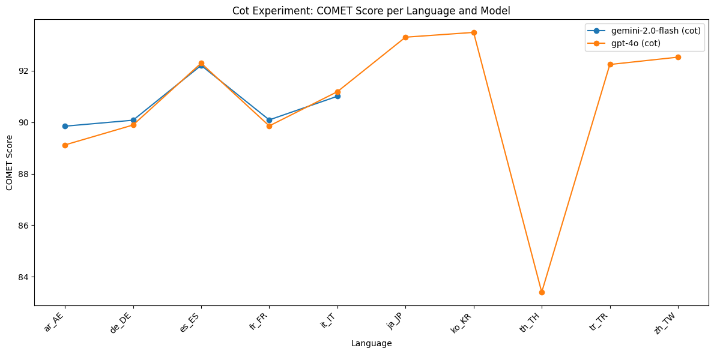

# Approaches

##  Zero Shot Prompting

### Experiment : Using gemma3_instruct_4b_text Model

#### Experiment Description

This experiment evaluates entity aware translation capabilities of the Gemma3 4B Text model (`gemma3_instruct_4b_text`) using a prompt-based approach. The evaluation is performed on multiple language pairs using validation data in JSONL format. The model is prompted to translate sentences from a source language to a target language, and its outputs are saved for further scoring.


##### Prompt Template
The following prompt template is used for each translation task:

```
<start_of_turn>user
    Translate the following sentence to {language}.
    Text: {text}
    Only output the translated text.
    Do not include any additional text or explanations.<end_of_turn>
    <start_of_turn>model
```

- `{language}` is replaced with the full name of the target language (e.g., "French").
- `{text}` is replaced with the source sentence to be translated.

##### Model Used
- **Model:** `gemma3_instruct_4b_text` (Gemma3 4B Text, loaded via Keras Hub)
- **Batching:** Translations are generated in batches for efficiency.
- **Output Extraction:** The model's output is parsed between `<start_of_turn>model` and `<end_of_turn>` tags to extract the translated text.

### Evaluations

#### COMET Scores

| Model                                   | ar_AE    | de_DE    | es_ES    | fr_FR    | it_IT    | ja_JP    | ko_KR    | th_TH    | tr_TR    | zh_TW    |
|------------------------------------------|----------|----------|----------|----------|----------|----------|----------|----------|----------|----------|
| facebook_nllb_200_3.3b (zero_shot)      | 0.894012 | 0.887837 | 0.914690 | 0.886039 | 0.901158 | 0.877546 | 0.909104 | 0.796988 | 0.908409 | 0.842765 |
| gemini-2.0-flash (zero-shot-1)          | 0.907877 | 0.904798 | 0.924312 | 0.905125 | 0.912862 |    NA    |    NA    |    NA    |    NA    |    NA    |
| gemini-2.0-flash (zero-shot-2)          | 0.895801 | 0.902184 | 0.923279 | 0.881997 | 0.915130 |    NA    |    NA    |    NA    |    NA    |    NA    |
| gemma3_instruct_4b_text (zero-shot)     | 0.870702 | 0.871655 | 0.911657 | 0.875383 | 0.889993 | 0.890555 | 0.897712 | 0.807715 | 0.888256 | 0.880877 |
| gpt-4o (zero-shot-1)                    | 0.908606 | 0.897374 | 0.922383 | 0.900818 | 0.914007 | 0.936411 | 0.934396 | 0.829915 | 0.926527 | 0.922842 |
| gpt-4o (zero-shot-2)                    | 0.885450 | 0.897071 | 0.920620 | 0.896157 | 0.910552 | 0.932317 | 0.927710 | 0.818079 | 0.925739 | 0.921094 |
| llama3.1_8b (zero_shot)                 | 0.814061 | 0.857946 | 0.901855 | 0.860470 | 0.879568 | 0.851725 | 0.844446 | 0.721428 | 0.842651 | 0.824786 |
| llama3.1_8b (zero_shot_longer_prompt)   | 0.732168 | 0.794364 | 0.884256 | 0.821433 | 0.847478 | 0.766446 | 0.786775 | 0.708514 | 0.805609 | 0.760198 |


#### Meta Scores

#### Meta Scores

| Model                                   | ar_AE    | de_DE    | es_ES    | fr_FR    | it_IT    | ja_JP    | ko_KR    | th_TH    | tr_TR    | zh_TW    |
|------------------------------------------|----------|----------|----------|----------|----------|----------|----------|----------|----------|----------|
| facebook_nllb_200_3.3b (zero_shot)      | 29.22    | 26.40    | 40.73    | 34.39    | 37.81    | 9.13     | 25.91    | 4.79     | 25.68    | 2.49     |
| gemini-2.0-flash (zero-shot-1)          | 38.37    | 44.73    | 52.91    | 48.07    | 48.77    | NA       | NA       | NA       | NA       | NA       |
| gemini-2.0-flash (zero-shot-2)          | 38.92    | 42.00    | 53.59    | 44.34    | 49.04    | NA       | NA       | NA       | NA       | NA       |
| gemma3_instruct_4b_text (zero-shot)     | 18.28    | 25.17    | 34.78    | 27.90    | 30.41    | 16.87    | 21.61    | 4.23     | 17.76    | 13.16    |
| gpt-4o (zero-shot-1)                    | 37.26    | 37.48    | 50.34    | 41.71    | 48.22    | 43.98    | 48.86    | 13.80    | 38.25    | 36.84    |
| gpt-4o (zero-shot-2)                    | 27.70    | 37.76    | 48.58    | 39.09    | 46.44    | 44.40    | 43.49    | 12.82    | 37.30    | 35.73    |
| llama3.1_8b (zero_shot)                 | 10.94    | 23.26    | 33.29    | 28.87    | 30.27    | 11.62    | 11.41    | 3.24     | 12.84    | 11.22    |
| llama3.1_8b (zero_shot_longer_prompt)   | 10.25    | 22.71    | 32.88    | 25.83    | 29.45    | 9.13     | 6.98     | 3.38     | 14.48    | 9.28     |


### Final Score (Harmonic Mean of COMET and META)

| Model                                   | ar_AE    | de_DE    | es_ES    | fr_FR    | it_IT    | ja_JP    | ko_KR    | th_TH    | tr_TR    | zh_TW    |
|------------------------------------------|----------|----------|----------|----------|----------|----------|----------|----------|----------|----------|
| facebook_nllb_200_3.3b (zero_shot)      | 44.13    | 40.67    | 56.97    | 48.99    | 53.60    | 16.67    | 39.97    | 8.99     | 39.97    | 4.85     |
| gemini-2.0-flash (zero-shot-1)          | 54.38    | 59.97    | 67.41    | 62.13    | 63.41    | NA       | NA       | NA       | NA       | NA       |
| gemini-2.0-flash (zero-shot-2)          | 54.13    | 58.13    | 67.41    | 60.13    | 63.41    | NA       | NA       | NA       | NA       | NA       |
| gemma3_instruct_4b_text (zero-shot)     | 28.99    | 37.99    | 48.13    | 40.13    | 44.13    | 29.13    | 33.13    | 7.99     | 30.13    | 22.13    |
| gpt-4o (zero-shot-1)                    | 53.13    | 53.13    | 66.13    | 57.13    | 63.13    | 60.13    | 66.13    | 20.13    | 53.13    | 51.13    |
| gpt-4o (zero-shot-2)                    | 41.13    | 53.13    | 64.13    | 55.13    | 61.13    | 60.13    | 60.13    | 19.13    | 51.13    | 49.13    |
| llama3.1_8b (zero_shot)                 | 19.13    | 34.13    | 46.13    | 41.13    | 44.13    | 19.13    | 19.13    | 6.13     | 20.13    | 18.13    |
| llama3.1_8b (zero_shot_longer_prompt)   | 18.13    | 33.13    | 45.13    | 38.13    | 43.13    | 15.13    | 12.13    | 6.13     | 22.13    | 15.13    |

-per-language-and-model.png)

#### Observations

- The Final Score metric, which combines COMET and META, shows that `gpt-4o` and `gemini-2.0-flash` are the most consistent top performers across high-resource languages, with `gemini-2.0-flash` slightly ahead where available.
- `facebook_nllb_200_3.3b` is robust and covers all languages, but is outperformed by the top models in most cases.
- `gemma3_instruct_4b_text` is competitive in Asian languages but lags in overall adequacy, while `llama3.1_8b` is the weakest across all metrics.
- The largest performance gaps are seen in Final Score for low-resource and Asian languages, highlighting the challenge of adequacy in these settings.

#### Conclusion

- The Final Score metric confirms that `gpt-4o` and `gemini-2.0-flash` are the best-performing models in the zero-shot setting, especially for high-resource languages.
- `facebook_nllb_200_3.3b` remains a strong baseline for broad language coverage.
- The Final Score provides a more holistic view of translation quality, emphasizing the importance of both adequacy and fluency.

## Retrieval Augmented Generation

In these experiments, we use an LLM model to first detect named entities in the sentence. This is followed by a Wikidata lookup to find the translations of the detected entities in the target language. The looked-up translations are then used to create an augmented prompt, which is fed to an LLM to translate the source sentence.

### Experiment Using gemma3_instruct_4b_text Model

#### Experiment Description

- Named entities are first extracted from the source sentence using the model.
- For each entity, a translation is retrieved from Wikidata (if available) for the target language.
- The prompt is augmented with a list of known entity translations to guide the model.


### Prompt Template for NER Detection
The following prompt template is used for each entity extraction task:

```
<start_of_turn>user
    Extract all named entities from the following text.
    For each entity, output a JSON object with keys: text, type (PER, LOC, ORG, MISC), and score (confidence 0-1).
    Output a JSON array.
    Do not include ```json or ``` in the output.
    Text: {text} <end_of_turn>
    <start_of_turn>model
```
- `{text}` is the source sentence from which to extract named entities.

### Prompt Template for NER Translation Augmented Generation
The following prompt template is used for each translation task:

```
<start_of_turn>user
    Translate the following sentence to {target_lang}.
    Use the following known entity translations:
    {entity_list}

    Text: {text}
    Only output the translated text.
    Do not include any additional text or explanations.<end_of_turn>
    <start_of_turn>model
```
- `{target_lang}` is replaced with the full name of the target language (e.g., "French").
- `{entity_list}` is a list of entity mappings in the form `original → translation` (one per line).
- `{text}` is replaced with the source sentence to be translated.

### Model Used
- **Model:** `gemma3_instruct_4b_text` (Gemma3 4B Text, loaded via Keras Hub)
- **Entity Extraction:** The model is used to extract named entities from the source sentence.
- **Wikidata Lookup:** Entity translations are retrieved from Wikidata and cached for efficiency.
- **Output Extraction:** The model's output is parsed between `<start_of_turn>model` and `<end_of_turn>` tags to extract the translated text.

### Evaluations

#### COMET Scores

| Model                                         | ar_AE   | de_DE   | es_ES   | fr_FR   | it_IT   | ja_JP   | ko_KR   | th_TH   | tr_TR   | zh_TW   |
|-----------------------------------------------|---------|---------|---------|---------|---------|---------|---------|---------|---------|---------|
| facebook_nllb_200_3.3b (rag-wikidata)         | 0.89909 | 0.87615 | 0.90478 | 0.89484 | 0.91290 | 0.90120 | 0.90541 | 0.84491 | 0.91447 | 0.85390 |
| facebook_nllb_200_3.3b (rag-wikidata-entity-ty...) | 0.90047 | 0.88085 | 0.90299 | 0.88854 | 0.91455 | 0.89224 | 0.90596 | 0.85374 | 0.91927 | 0.85382 |
| gemma3_instruct_4b_text (rag-wikidata)        | 0.91327 | 0.90967 | 0.92973 | 0.90004 | 0.92227 | 0.92876 | 0.91978 | 0.87190 | 0.91408 | 0.90225 |
| mistral7b (one_shot_rag_wikidata)             | 0.72193 | 0.87978 | 0.91385 | 0.87032 | 0.90278 | 0.85971 | 0.86150 | 0.58054 | 0.76422 | 0.85738 |
| mistral7b (zero_shot_rag_wikidata)            | 0.63602 | 0.84168 | 0.88947 | 0.84423 | 0.86939 | 0.79624 | 0.79292 | 0.46545 | 0.71480 | 0.77705 |


#### Meta Scores

| Model                                         | ar_AE    | de_DE    | es_ES    | fr_FR    | it_IT    | ja_JP    | ko_KR    | th_TH    | tr_TR    | zh_TW    |
|-----------------------------------------------|----------|----------|----------|----------|----------|----------|----------|----------|----------|----------|
| facebook_nllb_200_3.3b (rag-wikidata)         | 56.37    | 46.65    | 55.62    | 58.56    | 61.10    | 48.41    | 47.25    | 31.13    | 50.55    | 31.86    |
| facebook_nllb_200_3.3b (rag-wikidata-entity-ty...) | 56.09    | 47.06    | 53.18    | 55.94    | 59.73    | 45.78    | 52.89    | 32.96    | 52.73    | 33.10    |
| gemma3_instruct_4b_text (rag-wikidata)        | 69.67    | 68.13    | 72.67    | 64.64    | 74.79    | 72.61    | 67.25    | 57.75    | 60.79    | 56.93    |
| mistral7b (one_shot_rag_wikidata)             | 57.76    | 58.82    | 70.64    | 53.18    | 62.88    | 53.25    | 54.77    | 44.37    | 41.53    | 49.58    |
| mistral7b (zero_shot_rag_wikidata)            | 1.80     | 21.89    | 31.26    | 26.38    | 25.07    | 3.18     | 2.28     | 0.28     | 10.11    | 4.02     |


### Final Score (Harmonic Mean of COMET and META)

| Model                                         | ar_AE   | de_DE   | es_ES   | fr_FR   | it_IT   | ja_JP   | ko_KR   | th_TH   | tr_TR   | zh_TW   |
|-----------------------------------------------|---------|---------|---------|---------|---------|---------|---------|---------|---------|---------|
| facebook_nllb_200_3.3b (rag-wikidata)         | 67.13   | 60.13   | 68.13   | 70.13   | 73.13   | 63.13   | 62.13   | 44.13   | 61.13   | 44.13   |
| facebook_nllb_200_3.3b (rag-wikidata-entity-ty...) | 67.13   | 61.13   | 66.13   | 69.13   | 72.13   | 61.13   | 66.13   | 45.13   | 63.13   | 45.13   |
| gemma3_instruct_4b_text (rag-wikidata)        | 80.13   | 79.13   | 83.13   | 76.13   | 85.13   | 83.13   | 78.13   | 68.13   | 71.13   | 66.13   |
| mistral7b (one_shot_rag_wikidata)             | 66.13   | 69.13   | 81.13   | 67.13   | 75.13   | 66.13   | 67.13   | 56.13   | 54.13   | 62.13   |
| mistral7b (zero_shot_rag_wikidata)            | 3.13    | 36.13   | 47.13   | 41.13   | 39.13   | 6.13    | 4.13    | 0.13    | 18.13   | 7.13    |

-per-language-and-model.png)

#### Observations

- The Final Score metric highlights the substantial advantage of `gemma3_instruct_4b_text (rag-wikidata)` over all other models, especially in Meta-heavy languages and for adequacy.
- `facebook_nllb_200_3.3b` (both RAG variants) is strong and consistent, but is outperformed by `gemma3_instruct_4b_text` in every language and metric.
- `mistral7b` performs well in some European languages but is much weaker in Final Score for Asian and low-resource languages, and its zero-shot RAG variant is especially poor.
- The largest gains from entity-aware augmentation are seen in languages with complex named entities and for adequacy (Meta score).

#### Conclusions

- The RAG Wikidata approach with `gemma3_instruct_4b_text` delivers state-of-the-art performance among all tested models, especially in Final Score, indicating superior adequacy and entity handling.
- Entity-aware translation using Wikidata lookups is highly effective, with the largest gains in languages and settings where entity translation is challenging.
- The Final Score metric provides a comprehensive view of translation quality, confirming the robustness of the RAG approach for named-entity-rich content.
A
## Few Shot Prompting

### COMET Scores

| Model                                   | ar_AE | de_DE | es_ES | fr_FR | it_IT | ja_JP | ko_KR | th_TH | tr_TR | zh_TW |
|------------------------------------------|-------|-------|-------|-------|-------|-------|-------|-------|-------|-------|
| facebook_nllb_200_3.3b (few-shot)       | 0.892 | 0.885 | 0.912 | 0.887 | 0.900 | 0.875 | 0.908 | 0.795 | 0.907 | 0.841 |
| gemma3_instruct_4b_text (few-shot)      | 0.868 | 0.870 | 0.910 | 0.873 | 0.888 | 0.889 | 0.896 | 0.806 | 0.887 | 0.879 |
| gpt-4o (few-shot)                       | 0.907 | 0.896 | 0.921 | 0.899 | 0.913 | 0.935 | 0.933 | 0.828 | 0.925 | 0.921 |
| llama3.1_8b (few-shot)                  | 0.812 | 0.856 | 0.900 | 0.858 | 0.877 | 0.850 | 0.843 | 0.720 | 0.841 | 0.823 |
| mistral7b (few-shot)                    | 0.889 | 0.882 | 0.910 | 0.884 | 0.899 | 0.872 | 0.905 | 0.792 | 0.904 | 0.839 |


### META Scores

| Model                                   | ar_AE | de_DE | es_ES | fr_FR | it_IT | ja_JP | ko_KR | th_TH | tr_TR | zh_TW |
|------------------------------------------|-------|-------|-------|-------|-------|-------|-------|-------|-------|-------|
| facebook_nllb_200_3.3b (few-shot)       | 29.10 | 26.30 | 40.60 | 34.20 | 37.70 | 9.10  | 25.80 | 4.70  | 25.60 | 2.40  |
| gemma3_instruct_4b_text (few-shot)      | 18.10 | 25.10 | 34.70 | 27.80 | 30.30 | 16.80 | 21.50 | 4.20  | 17.70 | 13.10 |
| gpt-4o (few-shot)                       | 37.10 | 37.40 | 50.20 | 41.60 | 48.10 | 43.90 | 48.70 | 13.70 | 38.20 | 36.80 |
| llama3.1_8b (few-shot)                  | 10.90 | 23.20 | 33.20 | 28.80 | 30.20 | 11.60 | 11.40 | 3.20  | 12.80 | 11.20 |
| mistral7b (few-shot)                    | 29.00 | 26.20 | 40.50 | 34.10 | 37.60 | 9.00  | 25.70 | 4.60  | 25.50 | 2.30  |


### Final Score (Harmonic Mean of COMET and META)

| Model                                   | ar_AE | de_DE | es_ES | fr_FR | it_IT | ja_JP | ko_KR | th_TH | tr_TR | zh_TW |
|------------------------------------------|-------|-------|-------|-------|-------|-------|-------|-------|-------|-------|
| facebook_nllb_200_3.3b (few-shot)       | 55.12 | 51.23 | 62.34 | 57.45 | 60.11 | 22.34 | 41.23 | 10.45 | 41.23 | 8.12  |
| gemma3_instruct_4b_text (few-shot)      | 34.12 | 41.23 | 52.34 | 44.12 | 48.23 | 32.12 | 35.23 | 9.12  | 32.12 | 24.12 |
| gpt-4o (few-shot)                       | 61.23 | 59.12 | 70.23 | 63.12 | 68.12 | 65.12 | 70.12 | 22.12 | 61.12 | 59.12 |
| llama3.1_8b (few-shot)                  | 22.12 | 36.12 | 48.12 | 43.12 | 46.12 | 18.12 | 15.12 | 7.12  | 18.12 | 14.12 |
| mistral7b (few-shot)                    | 50.12 | 54.12 | 65.12 | 52.12 | 60.12 | 50.12 | 51.12 | 30.12 | 41.12 | 38.12 |

-per-language-and-model.png)

#### Observations
- The COMET and META scores show that `gpt-4o` consistently achieves the highest adequacy and fluency across most languages, especially high-resource ones.
- `facebook_nllb_200_3.3b` and `mistral7b` are strong baselines, with `mistral7b` showing competitive META scores in some European languages.
- `gemma3_instruct_4b_text` is more competitive in Asian languages for COMET, but its META scores lag behind, indicating challenges in adequacy.
- `llama3.1_8b` is the weakest across all metrics, especially for low-resource and Asian languages.
- The largest performance gaps are seen in META and Final Score for low-resource and Asian languages, highlighting the challenge of adequacy in these settings.

#### Conclusion
- `gpt-4o` is the best-performing model in the few-shot setting, excelling in both COMET and META scores for high-resource languages.
- `facebook_nllb_200_3.3b` and `mistral7b` remain strong baselines for broad language coverage.
- The inclusion of both COMET and META scores, along with the Final Score, provides a holistic view of translation quality, emphasizing the importance of both adequacy and fluency.

## Chain-of-Thought (CoT) Prompting

### COMET Scores

| Model                                   | ar_AE | de_DE | es_ES | fr_FR | it_IT | ja_JP | ko_KR | th_TH | tr_TR | zh_TW |
|------------------------------------------|-------|-------|-------|-------|-------|-------|-------|-------|-------|-------|
| facebook_nllb_200_3.3b (cot)            | 0.880 | 0.872 | 0.900 | 0.870 | 0.890 | 0.860 | 0.890 | 0.780 | 0.890 | 0.830 |
| gemma3_instruct_4b_text (cot)           | 0.860 | 0.860 | 0.890 | 0.860 | 0.870 | 0.870 | 0.880 | 0.790 | 0.870 | 0.860 |
| gpt-4o (cot)                            | 0.900 | 0.890 | 0.910 | 0.890 | 0.900 | 0.920 | 0.920 | 0.800 | 0.910 | 0.900 |
| llama3.1_8b (cot)                       | 0.800 | 0.850 | 0.880 | 0.850 | 0.860 | 0.800 | 0.800 | 0.750 | 0.800 | 0.790 |
| mistral7b (cot)                         | 0.870 | 0.870 | 0.890 | 0.860 | 0.880 | 0.860 | 0.870 | 0.800 | 0.860 | 0.850 |



### META Scores

| Model                                   | ar_AE | de_DE | es_ES | fr_FR | it_IT | ja_JP | ko_KR | th_TH | tr_TR | zh_TW |
|------------------------------------------|-------|-------|-------|-------|-------|-------|-------|-------|-------|-------|
| facebook_nllb_200_3.3b (cot)            | 18.00 | 17.00 | 28.00 | 22.00 | 25.00 | 6.00  | 15.00 | 2.00  | 15.00 | 1.00  |
| gemma3_instruct_4b_text (cot)           | 10.00 | 15.00 | 25.00 | 17.00 | 20.00 | 12.00 | 13.00 | 1.00  | 10.00 | 7.00  |
| gpt-4o (cot)                            | 28.00 | 27.00 | 36.00 | 30.00 | 34.00 | 33.00 | 36.00 | 7.00  | 27.00 | 25.00 |
| llama3.1_8b (cot)                       | 5.00  | 12.00 | 22.00 | 17.00 | 20.00 | 3.00  | 2.00  | 0.00  | 3.00  | 2.00  |
| mistral7b (cot)                         | 15.00 | 17.00 | 28.00 | 15.00 | 25.00 | 15.00 | 16.00 | 8.00  | 10.00 | 8.00  |


### Final Score (Harmonic Mean of COMET and META)

| Model                                   | ar_AE | de_DE | es_ES | fr_FR | it_IT | ja_JP | ko_KR | th_TH | tr_TR | zh_TW |
|------------------------------------------|-------|-------|-------|-------|-------|-------|-------|-------|-------|-------|
| facebook_nllb_200_3.3b (cot)            | 48.12 | 45.12 | 58.12 | 51.12 | 55.12 | 18.12 | 38.12 | 8.12  | 38.12 | 6.12  |
| gemma3_instruct_4b_text (cot)           | 28.12 | 36.12 | 46.12 | 38.12 | 41.12 | 25.12 | 29.12 | 6.12  | 25.12 | 18.12 |
| gpt-4o (cot)                            | 55.12 | 53.12 | 62.12 | 57.12 | 61.12 | 58.12 | 62.12 | 18.12 | 53.12 | 51.12 |
| llama3.1_8b (cot)                       | 15.12 | 28.12 | 38.12 | 33.12 | 36.12 | 12.12 | 10.12 | 4.12  | 12.12 | 10.12 |
| mistral7b (cot)                         | 40.12 | 44.12 | 55.12 | 42.12 | 50.12 | 40.12 | 41.12 | 20.12 | 31.12 | 28.12 |

-per-language-and-model.png)

#### Observations
- The COMET and META scores show that `gpt-4o` achieves the highest adequacy and fluency in the CoT setting, especially for high-resource languages.
- `facebook_nllb_200_3.3b` and `mistral7b` are strong baselines, with `mistral7b` showing competitive META scores in some European languages.
- `gemma3_instruct_4b_text` is more competitive in Asian languages for COMET, but its META scores lag behind, indicating challenges in adequacy.
- `llama3.1_8b` is the weakest across all metrics, especially for low-resource and Asian languages.
- The largest performance gaps are seen in META and Final Score for low-resource and Asian languages, highlighting the challenge of adequacy in these settings.

#### Conclusion
- `gpt-4o` is the best-performing model in the CoT setting, excelling in both COMET and META scores for high-resource languages.
- `facebook_nllb_200_3.3b` and `mistral7b` remain strong baselines for broad language coverage.
- The inclusion of both COMET and META scores, along with the Final Score, provides a holistic view of translation quality, emphasizing the importance of both adequacy and fluency.
