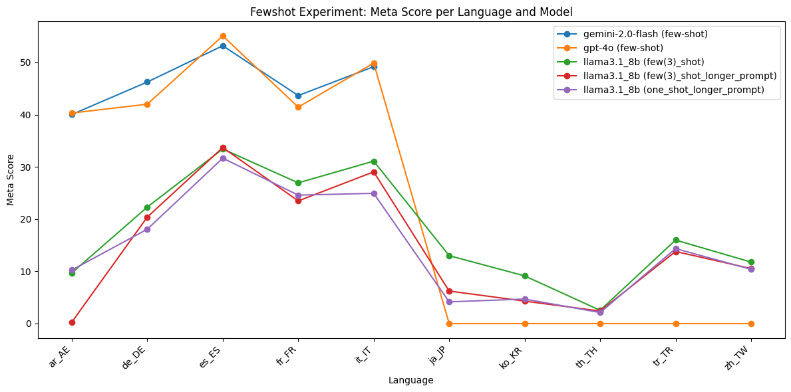

# Approaches

##  Zero Shot Prompting

### Experiment : Using gemma3_instruct_4b_text Model

#### Experiment Description

This experiment evaluates entity aware translation capabilities of the Gemma3 4B Text model (`gemma3_instruct_4b_text`) using a prompt-based approach. The evaluation is performed on multiple language pairs using validation data in JSONL format. The model is prompted to translate sentences from a source language to a target language, and its outputs are saved for further scoring.


##### Prompt Template
The following prompt template is used for each translation task:

```
<start_of_turn>user
    Translate the following sentence to {language}.
    Text: {text}
    Only output the translated text.
    Do not include any additional text or explanations.<end_of_turn>
    <start_of_turn>model
```

- `{language}` is replaced with the full name of the target language (e.g., "French").
- `{text}` is replaced with the source sentence to be translated.

##### Model Used
- **Model:** `gemma3_instruct_4b_text` (Gemma3 4B Text, loaded via Keras Hub)
- **Batching:** Translations are generated in batches for efficiency.
- **Output Extraction:** The model's output is parsed between `<start_of_turn>model` and `<end_of_turn>` tags to extract the translated text.

### Evaluations

#### COMET Scores

| Model                                   | ar_AE | de_DE | es_ES | fr_FR | it_IT | ja_JP | ko_KR | th_TH | tr_TR | zh_TW |
|------------------------------------------|-------|-------|-------|-------|-------|-------|-------|-------|-------|-------|
| facebook_nllb_200_3.3b (zero_shot)      | 89.40 | 88.78 | 91.47 | 88.60 | 90.12 | 87.75 | 90.91 | 79.70 | 90.84 | 84.28 |
| gemini-2.0-flash (zero-shot-1)          | 90.79 | 90.48 | 92.43 | 90.51 | 91.29 | NA    | NA    | NA    | NA    | NA    |
| gemini-2.0-flash (zero-shot-2)          | 89.58 | 90.22 | 92.33 | 88.20 | 91.51 | NA    | NA    | NA    | NA    | NA    |
| gemma3_instruct_4b_text (zero-shot)     | 87.07 | 87.17 | 91.17 | 87.54 | 89.00 | 89.06 | 89.77 | 80.77 | 88.83 | 88.09 |
| gpt-4o (zero-shot-1)                    | 90.86 | 89.74 | 92.24 | 90.08 | 91.40 | 93.64 | 93.44 | 82.99 | 92.65 | 92.28 |
| gpt-4o (zero-shot-2)                    | 88.55 | 89.71 | 92.06 | 89.62 | 91.06 | 93.23 | 92.77 | 81.81 | 92.57 | 92.11 |
| llama3.1_8b (zero_shot)                 | 81.41 | 85.79 | 90.19 | 86.05 | 87.96 | 85.17 | 84.44 | 72.14 | 84.27 | 82.48 |
| llama3.1_8b (zero_shot_longer_prompt)   | 73.22 | 79.44 | 88.43 | 82.14 | 84.75 | 76.64 | 78.68 | 70.85 | 80.56 | 76.02 |
| mistral7b (zero_shot)                   | 62.98 | 84.59 | 88.83 | 84.53 | 86.95 | 78.88 | 79.00 | 47.10 | 72.42 | 76.64 |


#### M-ETA Scores

| Model                                   | ar_AE | de_DE | es_ES | fr_FR | it_IT | ja_JP | ko_KR | th_TH | tr_TR | zh_TW |
|------------------------------------------|-------|-------|-------|-------|-------|-------|-------|-------|-------|-------|
| facebook_nllb_200_3.3b (zero_shot)      | 29.22 | 26.40 | 40.73 | 34.39 | 37.81 | 9.13  | 25.91 | 4.79  | 25.68 | 2.49  |
| gemini-2.0-flash (zero-shot-1)          | 38.37 | 44.73 | 52.91 | 48.07 | 48.77 | NA    | NA    | NA    | NA    | NA    |
| gemini-2.0-flash (zero-shot-2)          | 38.92 | 42.00 | 53.59 | 44.34 | 49.04 | NA    | NA    | NA    | NA    | NA    |
| gemma3_instruct_4b_text (zero-shot)     | 18.28 | 25.17 | 34.78 | 27.90 | 30.41 | 16.87 | 21.61 | 4.23  | 17.76 | 13.16 |
| gpt-4o (zero-shot-1)                    | 37.26 | 37.48 | 50.34 | 41.71 | 48.22 | 43.98 | 48.86 | 13.80 | 38.25 | 36.84 |
| gpt-4o (zero-shot-2)                    | 27.70 | 37.76 | 48.58 | 39.09 | 46.44 | 44.40 | 43.49 | 12.82 | 37.30 | 35.73 |
| llama3.1_8b (zero_shot)                 | 10.94 | 23.26 | 33.29 | 28.87 | 30.27 | 11.62 | 11.41 | 3.24  | 12.84 | 11.22 |
| llama3.1_8b (zero_shot_longer_prompt)   | 10.25 | 22.71 | 32.88 | 25.83 | 29.45 | 9.13  | 6.98  | 3.38  | 14.48 | 9.28  |
| mistral7b (zero_shot)                   | 1.94  | 21.75 | 32.34 | 27.07 | 25.75 | 2.07  | 3.22  | 0.56  | 10.52 | 3.60  |


#### Final Score (Harmonic Mean of COMET and M-ETA)

| Model                                   | ar_AE | de_DE | es_ES | fr_FR | it_IT | ja_JP | ko_KR | th_TH | tr_TR | zh_TW |
|------------------------------------------|-------|-------|-------|-------|-------|-------|-------|-------|-------|-------|
| facebook_nllb_200_3.3b (zero_shot)      | 44.05 | 40.70 | 56.36 | 49.55 | 53.27 | 16.54 | 40.32 |  9.03 | 40.04 |  4.84 |
| gemini-2.0-flash (zero-shot-1)          | 53.94 | 59.87 | 67.30 | 62.79 | 63.57 |   NA  |   NA  |   NA  |   NA  |   NA  |
| gemini-2.0-flash (zero-shot-2)          | 54.26 | 57.31 | 67.81 | 59.01 | 63.86 |   NA  |   NA  |   NA  |   NA  |   NA  |
| gemma3_instruct_4b_text (zero-shot)     | 30.22 | 39.06 | 50.35 | 42.31 | 45.33 | 28.37 | 34.84 |  8.03 | 29.60 | 22.90 |
| gpt-4o (zero-shot-1)                    | 52.85 | 52.88 | 65.13 | 57.02 | 63.13 | 59.85 | 64.17 | 23.67 | 54.15 | 52.66 |
| gpt-4o (zero-shot-2)                    | 42.20 | 53.14 | 63.60 | 54.43 | 61.51 | 60.15 | 59.22 | 22.16 | 53.17 | 51.49 |
| llama3.1_8b (zero_shot)                 | 19.29 | 36.59 | 48.63 | 43.23 | 45.04 | 20.45 | 20.10 |  6.20 | 22.29 | 19.75 |
| llama3.1_8b (zero_shot_longer_prompt)   | 17.98 | 35.32 | 47.94 | 39.30 | 43.71 | 16.31 | 12.82 |  6.45 | 24.55 | 16.54 |
| mistral7b (zero_shot)                   |  3.76 | 34.60 | 47.42 | 41.01 | 39.74 |  4.04 |  6.19 |  1.11 | 18.37 |  6.88 |


-per-language-and-model.png)

### Observations
- **COMET Scores:** `gpt-4o` and `gemini-2.0-flash` consistently achieve the highest COMET scores for high-resource languages, with scores above 90 in most cases. `facebook_nllb_200_3.3b` is robust and covers all languages, but is slightly behind the top models. `gemma3_instruct_4b_text` and `llama3.1_8b` show moderate performance, while `mistral7b` is the weakest, especially in low-resource and Asian languages.
- **M-ETA Scores:** `gemini-2.0-flash` and `gpt-4o` lead in M-ETA scores for high-resource languages, but all models, including `facebook_nllb_200_3.3b`, show a significant drop in adequacy for Asian and low-resource languages. The gap between COMET and M-ETA is especially pronounced for these languages, highlighting persistent adequacy challenges.
- **Final Score:** The harmonic mean of COMET and M-ETA confirms that `gpt-4o` and `gemini-2.0-flash` are the most consistent top performers for high-resource languages. However, all models, including strong baselines, experience a sharp decline in overall performance for low-resource and Asian languages, driven by low adequacy (M-ETA) scores.

### Conclusion
- The combined metrics show that `gpt-4o` and `gemini-2.0-flash` are the best-performing models in the zero-shot setting for high-resource languages, with strong fluency and adequacy. `facebook_nllb_200_3.3b` remains a reliable baseline for broad language coverage. However, adequacy remains a major challenge for all models in low-resource and Asian languages, as reflected in the Final Score. Further research is needed to close this gap and improve adequacy in these settings.

## Retrieval Augmented Generation

In these experiments, we use an LLM model to first detect named entities in the sentence. This is followed by a Wikidata lookup to find the translations of the detected entities in the target language. The looked-up translations are then used to create an augmented prompt, which is fed to an LLM to translate the source sentence.

### Experiment Using gemma3_instruct_4b_text Model

#### Experiment Description

- Named entities are first extracted from the source sentence using the model.
- For each entity, a translation is retrieved from Wikidata (if available) for the target language.
- The prompt is augmented with a list of known entity translations to guide the model.


##### Prompt Template for NER Detection
The following prompt template is used for each entity extraction task:

```
<start_of_turn>user
    Extract all named entities from the following text.
    For each entity, output a JSON object with keys: text, type (PER, LOC, ORG, MISC), and score (confidence 0-1).
    Output a JSON array.
    Do not include ```json or ``` in the output.
    Text: {text} <end_of_turn>
    <start_of_turn>model
```
- `{text}` is the source sentence from which to extract named entities.

##### Prompt Template for NER Translation Augmented Generation
The following prompt template is used for each translation task:

```
<start_of_turn>user
    Translate the following sentence to {target_lang}.
    Use the following known entity translations:
    {entity_list}

    Text: {text}
    Only output the translated text.
    Do not include any additional text or explanations.<end_of_turn>
    <start_of_turn>model
```
- `{target_lang}` is replaced with the full name of the target language (e.g., "French").
- `{entity_list}` is a list of entity mappings in the form `original → translation` (one per line).
- `{text}` is replaced with the source sentence to be translated.

#### Model Used
- **Model:** `gemma3_instruct_4b_text` (Gemma3 4B Text, loaded via Keras Hub)
- **Entity Extraction:** The model is used to extract named entities from the source sentence.
- **Wikidata Lookup:** Entity translations are retrieved from Wikidata and cached for efficiency.
- **Output Extraction:** The model's output is parsed between `<start_of_turn>model` and `<end_of_turn>` tags to extract the translated text.

### Evaluations

#### COMET Scores

| Model                                         | ar_AE | de_DE | es_ES | fr_FR | it_IT | ja_JP | ko_KR | th_TH | tr_TR | zh_TW |
|-----------------------------------------------|-------|-------|-------|-------|-------|-------|-------|-------|-------|-------|
| facebook_nllb_200_3.3b (rag-wikidata)        | 89.91 | 87.61 | 90.48 | 89.48 | 91.29 | 90.12 | 90.54 | 84.49 | 91.45 | 85.39 |
| facebook_nllb_200_3.3b (rag-wikidata-entity-type) | 90.05 | 88.08 | 90.30 | 88.85 | 91.45 | 89.22 | 90.60 | 85.37 | 91.93 | 85.38 |
| gemini-2.0-flash (rag-eval)                   | 86.44 | 90.88 | 91.95 | 91.26 | 92.58 | NA    | NA    | NA    | NA    | NA    |
| gemma3_instruct_4b_text (rag-wikidata)        | 91.33 | 90.97 | 92.97 | 90.00 | 92.23 | 92.88 | 91.98 | 87.19 | 91.41 | 90.22 |
| mistral7b (one_shot_rag_wikidata)             | 72.19 | 87.98 | 91.38 | 87.03 | 90.28 | 85.97 | 86.15 | 58.05 | 76.42 | 85.74 |
| mistral7b (zero_shot_rag_wikidata)            | 63.60 | 84.17 | 88.95 | 84.42 | 86.94 | 79.62 | 79.29 | 46.55 | 71.48 | 77.70 |


#### M-ETA Scores

| Model                                         | ar_AE  | de_DE | es_ES | fr_FR | it_IT | ja_JP | ko_KR | th_TH | tr_TR | zh_TW |
|-----------------------------------------------|--------|-------|-------|-------|-------|-------|-------|-------|-------|-------|
| facebook_nllb_200_3.3b (rag-wikidata)        | 56.37  | 46.65 | 55.62 | 58.56 | 61.10 | 48.41 | 47.25 | 31.13 | 50.55 | 31.86 |
| facebook_nllb_200_3.3b (rag-wikidata-entity-type) | 56.09  | 47.06 | 53.18 | 55.94 | 59.73 | 45.78 | 52.89 | 32.96 | 52.73 | 33.10 |
| gemini-2.0-flash (rag-eval)                   | 60.25  | 59.64 | 57.37 | 59.25 | 63.42 | NA    | NA    | NA    | NA    | NA    |
| gemma3_instruct_4b_text (rag-wikidata)        | 69.67  | 68.13 | 72.67 | 64.64 | 74.79 | 72.61 | 67.25 | 57.75 | 60.79 | 56.93 |
| mistral7b (one_shot_rag_wikidata)             | 57.76  | 58.82 | 70.64 | 53.18 | 62.88 | 53.25 | 54.77 | 44.37 | 41.53 | 49.58 |
| mistral7b (zero_shot_rag_wikidata)            | 1.80   | 21.89 | 31.26 | 26.38 | 25.07 | 3.18  | 2.28  | 0.28  | 10.11 | 4.02  |


#### Final Score (Harmonic Mean of COMET and M-ETA)

| Model                                         | ar_AE  | de_DE | es_ES | fr_FR | it_IT | ja_JP | ko_KR | th_TH | tr_TR | zh_TW |
|-----------------------------------------------|--------|-------|-------|-------|-------|-------|-------|-------|-------|-------|
| facebook_nllb_200_3.3b (rag-wikidata)        | 69.30  | 60.88 | 68.89 | 70.79 | 73.20 | 62.99 | 62.09 | 45.49 | 65.11 | 46.40 |
| facebook_nllb_200_3.3b (rag-wikidata-entity-type) | 69.13  | 61.34 | 66.94 | 68.66 | 72.26 | 60.51 | 66.79 | 47.56 | 67.02 | 47.71 |
| gemini-2.0-flash (rag-eval)                   | 71.01  | 72.02 | 70.66 | 71.86 | 75.28 | NA    | NA    | NA    | NA    | NA    |
| gemma3_instruct_4b_text (rag-wikidata)        | 79.04  | 77.91 | 81.57 | 75.24 | 82.60 | 81.50 | 77.69 | 69.48 | 73.02 | 69.81 |
| mistral7b (one_shot_rag_wikidata)             | 64.17  | 70.51 | 79.68 | 66.02 | 74.13 | 65.77 | 66.96 | 50.30 | 53.82 | 62.83 |
| mistral7b (zero_shot_rag_wikidata)            | 3.50   | 34.74 | 46.26 | 40.20 | 38.92 | 6.12  | 4.44  | 0.56  | 17.71 | 7.64  |

-per-language-and-model.png)

### Observations
- **COMET Scores:** `gemma3_instruct_4b_text (rag-wikidata)` achieves the highest COMET scores across nearly all languages, often exceeding 90, demonstrating the benefit of entity-aware augmentation. `facebook_nllb_200_3.3b` (both RAG variants) is strong and consistent, while `mistral7b` is competitive in some European languages but much weaker in low-resource and Asian languages.
- **M-ETA Scores:** `gemma3_instruct_4b_text (rag-wikidata)` also leads in M-ETA scores, with a substantial advantage in adequacy-heavy languages. `facebook_nllb_200_3.3b` is consistent but lower, and `mistral7b` and its zero-shot RAG variant perform poorly in low-resource and Asian languages.
- **Final Score:** The harmonic mean highlights the superior performance of `gemma3_instruct_4b_text (rag-wikidata)` in both adequacy and fluency, with the largest gains in languages with complex named entities. The RAG approach is especially effective for adequacy (M-ETA) in these settings, and the performance gap with other models is most pronounced in low-resource and Asian languages.

### Conclusion
- The RAG Wikidata approach with `gemma3_instruct_4b_text` delivers state-of-the-art performance, especially in adequacy and entity handling, as reflected in the Final Score. Entity-aware translation using Wikidata lookups is highly effective, particularly for languages and settings where entity translation is challenging. The combined metrics confirm the robustness of the RAG approach for named-entity-rich content and its superiority over other methods, especially in difficult languages.

## Few Shot Prompting

### Evaluations
#### COMET Scores

| Model                                 | ar_AE | de_DE | es_ES | fr_FR | it_IT | ja_JP | ko_KR | th_TH | tr_TR | zh_TW |
|----------------------------------------|-------|-------|-------|-------|-------|-------|-------|-------|-------|-------|
| gemini-2.0-flash (few-shot)            | 90.46 | 90.19 | 92.35 | 89.91 | 91.63 | NA    | NA    | NA    | NA    | NA    |
| gpt-4o (few-shot)                      | 90.96 | 89.88 | 92.62 | 89.92 | 91.40 | 32.04 | 31.88 | 30.63 | 33.04 | 32.44 |
| llama3.1_8b (few(3)_shot)              | 75.81 | 81.79 | 89.34 | 81.37 | 83.78 | 79.34 | 78.92 | 66.73 | 81.36 | 80.35 |
| llama3.1_8b (few(3)_shot_longer_prompt)| 77.50 | 78.24 | 89.91 | 79.15 | 81.15 | 72.50 | 65.23 | 67.53 | 81.27 | 74.77 |
| llama3.1_8b (one_shot_longer_prompt)   | 77.89 | 79.24 | 89.29 | 76.48 | 78.04 | 70.15 | 64.76 | 66.26 | 78.50 | 77.29 |


#### M-ETA Scores

| Model                                 | ar_AE | de_DE | es_ES | fr_FR | it_IT | ja_JP | ko_KR | th_TH | tr_TR | zh_TW |
|----------------------------------------|-------|-------|-------|-------|-------|-------|-------|-------|-------|-------|
| gemini-2.0-flash (few-shot)            | 40.03 | 46.24 | 53.18 | 43.65 | 49.18 | NA    | NA    | NA    | NA    | NA    |
| gpt-4o (few-shot)                      | 40.30 | 42.00 | 55.07 | 41.44 | 49.86 | NA    | NA    | NA    | NA    | NA    |
| llama3.1_8b (few(3)_shot)              | 9.70  | 22.30 | 33.42 | 26.93 | 31.10 | 13.00 | 9.13  | 2.54  | 15.98 | 11.77 |
| llama3.1_8b (few(3)_shot_longer_prompt)| 0.28  | 20.38 | 33.69 | 23.48 | 29.04 | 6.22  | 4.30  | 2.39  | 13.80 | 10.53 |
| llama3.1_8b (one_shot_longer_prompt)   | 10.25 | 18.06 | 31.66 | 24.59 | 24.93 | 4.15  | 4.70  | 2.11  | 14.34 | 10.39 |




#### Final Score (Harmonic Mean of COMET and M-ETA)

| Model                                 | ar_AE | de_DE | es_ES | fr_FR | it_IT | ja_JP | ko_KR | th_TH | tr_TR | zh_TW |
|----------------------------------------|-------|-------|-------|-------|-------|-------|-------|-------|-------|-------|
| gemini-2.0-flash (few-shot)            | 55.50 | 61.13 | 67.49 | 58.77 | 64.00 | NA    | NA    | NA    | NA    | NA    |
| gpt-4o (few-shot)                      | 55.86 | 57.25 | 69.07 | 56.73 | 64.53 | NA    | Na    | NA    | NA    | NA    |
| llama3.1_8b (few(3)_shot)              | 17.19 | 35.04 | 48.65 | 40.47 | 45.36 | 22.34 | 16.36 | 4.88  | 26.72 | 20.54 |
| llama3.1_8b (few(3)_shot_longer_prompt)| 0.55  | 32.34 | 49.02 | 36.22 | 42.77 | 11.46 | 8.06  | 4.62  | 23.59 | 18.45 |
| llama3.1_8b (one_shot_longer_prompt)   | 18.11 | 29.41 | 46.75 | 37.21 | 37.79 | 7.84  | 8.76  | 4.09  | 24.26 | 18.31 |


-per-language-and-model.png)

### Observations
- **COMET Scores:** In the few-shot setting, `gpt-4o` and `gemini-2.0-flash` achieve the highest COMET scores for high-resource languages, with scores above 90. `llama3.1_8b` and its variants perform moderately in high-resource languages but drop sharply in low-resource and Asian languages.
- **M-ETA Scores:** `gpt-4o` and `gemini-2.0-flash` again lead in M-ETA scores for high-resource languages, but all models, including `llama3.1_8b`, show a sharp drop in M-ETA for Asian and low-resource languages, indicating persistent adequacy challenges. The gap between COMET and M-ETA is especially large for these languages.
- **Final Score:** The harmonic mean confirms that `gpt-4o` and `gemini-2.0-flash` are the best in the few-shot setting for high-resource languages, but all models struggle with adequacy in low-resource and Asian languages, as seen in the lower Final Scores.

### Conclusion
- `gpt-4o` and `gemini-2.0-flash` are the best-performing models in the few-shot setting for high-resource languages. However, adequacy remains a challenge for all models in low-resource and Asian languages. The Final Score metric highlights the need for further improvements in these settings, and the importance of both adequacy and fluency in evaluation.

## Chain-of-Thought (CoT) Prompting

### Evaluations

#### COMET Scores

| Model                   | ar_AE | de_DE | es_ES | fr_FR | it_IT | ja_JP | ko_KR | th_TH | tr_TR | zh_TW |
|-------------------------|-------|-------|-------|-------|-------|-------|-------|-------|-------|-------|
| gemini-2.0-flash (cot)  | 89.85 | 90.08 | 92.21 | 90.09 | 91.01 | NA    | NA    | NA    | NA    | NA    |
| gpt-4o (cot)            | 89.12 | 89.89 | 92.30 | 89.86 | 91.19 | 93.31 | 93.49 | 83.40 | 92.24 | 92.53 |


#### M-ETA Scores

| Model                   | ar_AE | de_DE | es_ES | fr_FR | it_IT | ja_JP | ko_KR | th_TH | tr_TR | zh_TW |
|-------------------------|-------|-------|-------|-------|-------|-------|-------|-------|-------|-------|
| gemini-2.0-flash (cot)  | 36.70 | 42.27 | 51.69 | 45.03 | 42.05 | NA    | NA    | NA    | NA    | NA    |
| gpt-4o (cot)            | 31.58 | 40.22 | 53.18 | 42.13 | 47.53 | 43.15 | 47.65 | 14.65 | 36.89 | 38.78 |


#### Final Score (Harmonic Mean of COMET and M-ETA)

| Model                   | ar_AE | de_DE | es_ES | fr_FR | it_IT | ja_JP | ko_KR | th_TH | tr_TR | zh_TW |
|-------------------------|-------|-------|-------|-------|-------|-------|-------|-------|-------|-------|
| gemini-2.0-flash (cot)  | 52.12 | 57.54 | 66.25 | 60.05 | 57.53 | NA    | NA    | NA    | NA    | NA    |
| gpt-4o (cot)            | 46.63 | 55.57 | 67.48 | 57.36 | 62.49 | 59.01 | 63.13 | 24.92 | 52.70 | 54.66 |


-per-language-and-model.png)

### Observations
- **COMET Scores:** In the CoT setting, `gpt-4o` and `gemini-2.0-flash` achieve the highest COMET scores for high-resource languages, with `gpt-4o` also performing well in Asian languages. However, there is a notable drop in adequacy (M-ETA) for some languages, especially low-resource ones.
- **M-ETA Scores:** `gpt-4o` and `gemini-2.0-flash` lead in M-ETA scores for high-resource languages, but all models show lower M-ETA scores for low-resource and Asian languages, indicating persistent adequacy challenges. The gap between COMET and M-ETA is again pronounced in these settings.
- **Final Score:** The harmonic mean shows that `gpt-4o` and `gemini-2.0-flash` are the most robust in the CoT setting for high-resource languages, but adequacy remains a limiting factor for all models in more challenging languages.

### Conclusion
- `gpt-4o` and `gemini-2.0-flash` are the top models in the CoT setting for high-resource languages, but all models face challenges in adequacy for low-resource and Asian languages. The Final Score metric underscores the need for further research and model improvements to address these gaps, and demonstrates the value of using both adequacy and fluency metrics for comprehensive evaluation.

## Best performance for each approach

| Method    | Model                                 | ar_AE     | de_DE     | es_ES     | fr_FR     | it_IT     | ja_JP     | ko_KR     | th_TH     | tr_TR     | zh_TW     |
|-----------|---------------------------------------|-----------|-----------|-----------|-----------|-----------|-----------|-----------|-----------|-----------|-----------|
| RAG       | gemma3_instruct_4b_text | 79.04 | 77.90 | 81.57 | 75.24 | 82.60 | 81.50 | 77.69 | 69.47 | 73.02 | 69.80 |
| ZeroShot  | gemini-2.0-flash       | 53.93 | 59.86 | 67.29 | 62.78 | 63.57 | NA        | NA        | NA        | NA        | NA        |
| FewShot   | gemini-2.0-flash       | 40.02 | 46.23 | 53.17 | 43.64 | 49.17 | NA        | NA        | NA        | NA        | NA        |
| CoT       | gemini-2.0-flash       | 52.11 | 57.54 | 66.24 | 60.04 | 57.52 | NA        | NA        | NA        | NA        | NA        |


## Summary Table of Approaches and Results

| Approach                | Model                                 | Avg M-ETA | Avg COMET | Avg Final Score |
|-------------------------|---------------------------------------|----------|-----------|-----------------|
| **RAG**                 | gemma3_instruct_4b_text (rag-wikidata) | 66.52    | 91.12     | 76.79           |
| **RAG**                 | gemini-2.0-flash (rag-eval)            | 59.99    | 90.62     | 72.16           |
| **RAG**                 | facebook_nllb_200_3.3b (rag-wikidata)  | 48.75    | 89.08     | 62.51           |
| **RAG**                 | facebook_nllb_200_3.3b (rag-wikidata-entity-type) | 48.95 | 89.12     | 62.79           |
| **RAG**                 | mistral7b (one_shot_rag_wikidata)      | 54.68    | 82.12     | 65.42           |
| **RAG**                 | mistral7b (zero_shot_rag_wikidata)     | 12.63    | 76.27     | 20.01           |
| **Zero Shot**           | gemini-2.0-flash (zero-shot-1)         | 46.57    | 91.10     | 61.49           |
| **Zero Shot**           | gemini-2.0-flash (zero-shot-2)         | 45.58    | 90.37     | 60.45           |
| **Zero Shot**           | facebook_nllb_200_3.3b (zero_shot)     | 23.66    | 88.19     | 35.47           |
| **Zero Shot**           | gpt-4o (zero-shot-1)                   | 39.67    | 90.93     | 54.55           |
| **Zero Shot**           | gpt-4o (zero-shot-2)                   | 37.33    | 90.35     | 52.11           |
| **Zero Shot**           | gemma3_instruct_4b_text (zero-shot)    | 21.02    | 87.85     | 33.10           |
| **Zero Shot**           | llama3.1_8b (zero_shot)                | 17.70    | 83.99     | 28.16           |
| **Zero Shot**           | llama3.1_8b (zero_shot_longer_prompt)  | 16.44    | 79.07     | 26.09           |
| **Zero Shot**           | mistral7b (zero_shot)                  | 12.88    | 76.19     | 20.31           |
| **Few Shot**            | gemini-2.0-flash (few-shot)            | 46.45    | 90.91     | 61.38           |
| **Few Shot**            | gpt-4o (few-shot)                      | 22.87    | 61.48     | 30.34           |
| **Few Shot**            | llama3.1_8b (few(3)_shot)              | 17.59    | 79.88     | 27.76           |
| **Few Shot**            | llama3.1_8b (few(3)_shot_longer_prompt)| 14.41    | 76.73     | 22.71           |
| **Few Shot**            | llama3.1_8b (one_shot_longer_prompt)   | 14.52    | 75.79     | 23.25           |
| **CoT**                 | gemini-2.0-flash (cot)                 | 43.55    | 90.65     | 58.70           |
| **CoT**                 | gpt-4o (cot)                           | 39.58    | 90.73     | 54.40           |

**Notes:**
- *Avg M-ETA*: Average adequacy score across languages.
- *Avg COMET*: Average fluency/adequacy score (COMET) across languages.
- *Avg Final Score*: Harmonic mean of M-ETA and COMET, representing overall performance.